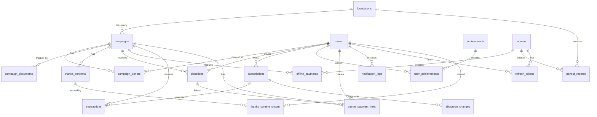

# Требования к базе данных: «По Рублю»

> **Контекст проекта:** REST API для благотворительного мобильного приложения (Flutter iOS/Android).
> Платформа позволяет пользователям оформлять подписки на микро-пожертвования и разовые донаты в пользу НКО-фондов через кампании сбора средств.
>
> **Стек:** FastAPI + PostgreSQL 16 + Redis 7 + Taskiq + YooKassa + Docker
> **ORM:** SQLAlchemy 2.0 (async) + asyncpg
> **Миграции:** Alembic
> **Все суммы:** в копейках (integer). Все даты: UTC. Первичные ключи: UUID v7.
> **Примечание:** функциональные требования v3.0 указывают UUID v4, данный документ использует **UUID v7** — монотонные, эффективнее для B-tree индексов в PostgreSQL. UUID v7 является окончательным решением.

---

## 1. Общие соглашения

### 1.1 Миксины (определяются в `app/models/base.py`)

| Миксин | Поля | Описание |
|--------|------|----------|
| **UUIDMixin** | `id: UUID` (PK, v7, `uuid_utils`) | Первичный ключ UUID v7 для всех таблиц |
| **TimestampMixin** | `created_at: datetime`, `updated_at: datetime` | `server_default=func.now()`, `onupdate=func.now()` |
| **SoftDeleteMixin** | `is_deleted: bool`, `deleted_at: datetime?` | Мягкое удаление (используется для User, Subscription, Donation) |

### 1.2 Правила

- PostgreSQL native ENUM (`SAEnum`) для enum-полей
- Внешние ключи: явно указывать `ondelete` (CASCADE / SET NULL / RESTRICT)
- Индексы на все поля, используемые в фильтрации, сортировке и JOIN
- `collected_amount` и `donors_count` обновляются **только** атомарным `UPDATE ... SET field = field + :value`
- Суммы — `Integer` (копейки), даты — `DateTime(timezone=True)` в UTC
- Nullable поля помечены явно
- **SoftDeleteMixin** добавляет оба поля `is_deleted` + `deleted_at`. Все таблицы, использующие миксин, обязаны иметь оба поля. `deleted_at` — техническое поле мягкого удаления; `cancelled_at` в subscriptions — отдельное бизнес-поле (дата отмены подписки), не заменяет `deleted_at`
- **DB constraints намеренно мягче бизнес-правил** — строгая валидация (например, минимум 1000 коп для `source=app`) реализуется на уровне приложения. DB constraint служит защитой от совсем невалидных данных
- **Reconciliation:** ежедневные Taskiq-задачи сверяют: (1) `campaigns.collected_amount` с `SUM(amount_kopecks)` по success-транзакциям + success-донатам + offline_payments; (2) `campaigns.donors_count` с `COUNT(*)` из `campaign_donors`; (3) `users.total_donated_kopecks` / `total_donations_count` с реальными данными. При расхождении — алерт в лог, не автоматическая коррекция

---

## 2. ENUM типы (PostgreSQL native)

```sql
-- Статусы фонда
CREATE TYPE foundation_status AS ENUM ('pending_verification', 'active', 'suspended');

-- Статусы кампании
CREATE TYPE campaign_status AS ENUM ('draft', 'active', 'paused', 'completed', 'archived');

-- Роли пользователя (donor-facing)
CREATE TYPE user_role AS ENUM ('donor', 'patron');

-- Push-платформа
CREATE TYPE push_platform AS ENUM ('fcm', 'apns');

-- Тип благодарности
CREATE TYPE thanks_content_type AS ENUM ('video', 'audio');

-- Статус доната
CREATE TYPE donation_status AS ENUM ('pending', 'success', 'failed', 'refunded');

-- Источник доната
CREATE TYPE donation_source AS ENUM ('app', 'patron_link', 'offline');

-- Метод офлайн-платежа
CREATE TYPE offline_payment_method AS ENUM ('cash', 'bank_transfer', 'other');

-- Период биллинга подписки
CREATE TYPE billing_period AS ENUM ('weekly', 'monthly');

-- Стратегия распределения
CREATE TYPE allocation_strategy AS ENUM ('platform_pool', 'foundation_pool', 'specific_campaign');

-- Статус подписки
CREATE TYPE subscription_status AS ENUM ('active', 'paused', 'cancelled', 'pending_payment_method');

-- Причина паузы
CREATE TYPE paused_reason AS ENUM ('user_request', 'no_campaigns', 'payment_failed');

-- Статус транзакции
CREATE TYPE transaction_status AS ENUM ('pending', 'success', 'failed', 'skipped', 'refunded');

-- Причина перераспределения
CREATE TYPE allocation_change_reason AS ENUM (
    'campaign_completed', 'campaign_closed_early',
    'no_campaigns_in_foundation', 'no_campaigns_on_platform',
    'manual_by_admin'
);

-- Тип условия достижения
CREATE TYPE achievement_condition_type AS ENUM ('streak_days', 'total_amount_kopecks', 'donations_count');

-- Статус ссылки мецената
CREATE TYPE patron_link_status AS ENUM ('pending', 'paid', 'expired');

-- Причина пропуска транзакции
CREATE TYPE skip_reason AS ENUM ('no_active_campaigns');

-- Статус уведомления
CREATE TYPE notification_status AS ENUM ('sent', 'mock', 'failed');
```

---

## 3. Таблицы

### 3.1 `foundations` — Фонды (НКО-партнёры)

| Поле | Тип | Constraints | Описание |
|------|-----|-------------|----------|
| id | UUID | PK (v7) | |
| name | VARCHAR(255) | NOT NULL | Публичное название |
| legal_name | VARCHAR(500) | NOT NULL | Юридическое название |
| inn | VARCHAR(12) | NOT NULL, UNIQUE | ИНН для верификации |
| description | TEXT | | До 2000 символов |
| logo_url | VARCHAR | | URL логотипа (S3/CDN) |
| website_url | VARCHAR | | Официальный сайт |
| status | foundation_status | NOT NULL, DEFAULT 'pending_verification' | |
| yookassa_shop_id | VARCHAR | | На старте null (общий счёт платформы) |
| verified_at | TIMESTAMPTZ | | Дата верификации |
| created_at | TIMESTAMPTZ | NOT NULL, DEFAULT now() | |
| updated_at | TIMESTAMPTZ | NOT NULL, DEFAULT now() | |

**Бизнес-правило:** Кампании фонда со статусом `suspended` не показываются в публичной ленте.

**Индексы:**
```sql
CREATE UNIQUE INDEX idx_foundations_inn ON foundations (inn);
CREATE INDEX idx_foundations_status ON foundations (status);
```

---

### 3.2 `campaigns` — Кампании сбора средств

| Поле | Тип | Constraints | Описание |
|------|-----|-------------|----------|
| id | UUID | PK (v7) | |
| foundation_id | UUID | FK → foundations(id) ON DELETE RESTRICT, NOT NULL | |
| title | VARCHAR(255) | NOT NULL | Заголовок |
| description | TEXT | | До 5000 символов |
| video_url | VARCHAR | | URL видео (S3/CDN) |
| thumbnail_url | VARCHAR | | URL превью |
| status | campaign_status | NOT NULL, DEFAULT 'draft' | |
| goal_amount | INTEGER | | Целевая сумма (копейки). NULL для бессрочных |
| collected_amount | INTEGER | NOT NULL, DEFAULT 0 | Собрано (копейки). Атомарное обновление! |
| donors_count | INTEGER | NOT NULL, DEFAULT 0 | Уникальные доноры. Обновляется через `campaign_donors` (см. 3.2a) |
| urgency_level | INTEGER | NOT NULL, DEFAULT 3, CHECK (1..5) | 1-5 |
| is_permanent | BOOLEAN | NOT NULL, DEFAULT false | Бессрочный сбор |
| ends_at | TIMESTAMPTZ | | Дата окончания |
| sort_order | INTEGER | NOT NULL, DEFAULT 0 | Ручная сортировка |
| closed_early | BOOLEAN | NOT NULL, DEFAULT false | Досрочно закрыт |
| close_note | TEXT | | Комментарий к закрытию (виден пользователям) |
| created_at | TIMESTAMPTZ | NOT NULL, DEFAULT now() | |
| updated_at | TIMESTAMPTZ | NOT NULL, DEFAULT now() | |

**Бизнес-правила:**
- Авто-завершение при `collected_amount >= goal_amount` если `is_permanent = false`
- `collected_amount` — только `UPDATE SET collected_amount = collected_amount + :amount`
- `donors_count` — инкрементировать только если `INSERT INTO campaign_donors ... ON CONFLICT DO NOTHING` вернул вставку (т.е. пользователь ещё не был донором этой кампании)
- Досрочное закрытие: `status=completed`, `closed_early=true`, `close_note=<текст>`

**Индексы:**
```sql
CREATE INDEX idx_campaigns_feed
    ON campaigns (urgency_level DESC, sort_order ASC, status)
    WHERE status = 'active';
CREATE INDEX idx_campaigns_foundation ON campaigns (foundation_id);
CREATE INDEX idx_campaigns_ends_at ON campaigns (ends_at)
    WHERE ends_at IS NOT NULL AND status = 'active' AND is_permanent = false;

-- Для сортировки по проценту заполнения
CREATE INDEX idx_campaigns_fill_rate
    ON campaigns ((collected_amount::numeric / NULLIF(goal_amount, 0)) DESC NULLS LAST)
    WHERE status = 'active' AND goal_amount IS NOT NULL;
```

> **Альтернатива:** вместо функционального индекса можно добавить generated column `fill_rate numeric GENERATED ALWAYS AS (collected_amount::numeric / NULLIF(goal_amount, 0)) STORED` и построить обычный B-tree индекс по нему. Это упрощает запросы (`ORDER BY fill_rate DESC`) и позволяет использовать поле в SELECT без повторного вычисления. Выбор зависит от частоты чтения vs. overhead на запись.

---

### 3.2a `campaign_donors` — Уникальные доноры кампании

Гарантирует корректный подсчёт `donors_count`. Без этой таблицы инкремент при каждом платеже считает дубликаты: 10 донатов одного пользователя = +10 к счётчику.

| Поле | Тип | Constraints | Описание |
|------|-----|-------------|----------|
| campaign_id | UUID | FK → campaigns(id) ON DELETE CASCADE, NOT NULL | PK (composite) |
| user_id | UUID | FK → users(id) ON DELETE CASCADE, NOT NULL | PK (composite) |
| first_at | TIMESTAMPTZ | NOT NULL, DEFAULT now() | Дата первого доната |

**PRIMARY KEY:** `(campaign_id, user_id)`

**Логика при успешном платеже:**
```sql
INSERT INTO campaign_donors (campaign_id, user_id)
VALUES (:cid, :uid)
ON CONFLICT DO NOTHING;
-- если вставка произошла (rowcount = 1):
UPDATE campaigns SET donors_count = donors_count + 1 WHERE id = :cid;
-- collected_amount обновляется всегда:
UPDATE campaigns SET collected_amount = collected_amount + :amount WHERE id = :cid;
```

**Индексы:**
```sql
-- PK уже покрывает поиск по (campaign_id, user_id)
CREATE INDEX idx_campaign_donors_user ON campaign_donors (user_id);
```

---

### 3.3 `campaign_documents` — Документы кампании (PDF)

| Поле | Тип | Constraints | Описание |
|------|-----|-------------|----------|
| id | UUID | PK (v7) | |
| campaign_id | UUID | FK → campaigns(id) ON DELETE CASCADE, NOT NULL | |
| title | VARCHAR(255) | NOT NULL | Название документа |
| file_url | VARCHAR | NOT NULL | URL PDF (S3) |
| sort_order | INTEGER | NOT NULL, DEFAULT 0 | Порядок |
| created_at | TIMESTAMPTZ | NOT NULL, DEFAULT now() | |

**Индексы:**
```sql
CREATE INDEX idx_campaign_documents_campaign ON campaign_documents (campaign_id, sort_order);
```

---

### 3.4 `thanks_contents` — Благодарность от фонда

| Поле | Тип | Constraints | Описание |
|------|-----|-------------|----------|
| id | UUID | PK (v7) | |
| campaign_id | UUID | FK → campaigns(id) ON DELETE CASCADE, NOT NULL | |
| type | thanks_content_type | NOT NULL | video / audio |
| media_url | VARCHAR | NOT NULL | URL медиа (S3/CDN) |
| title | VARCHAR(255) | | Заголовок |
| description | TEXT | | Текст |
| created_at | TIMESTAMPTZ | NOT NULL, DEFAULT now() | |

**Бизнес-правило:** Показывать донору после успешного списания, не чаще раза на устройство (трекинг через `thanks_content_shown`).

**Индексы:**
```sql
CREATE INDEX idx_thanks_contents_campaign ON thanks_contents (campaign_id);
```

---

### 3.4a `thanks_content_shown` — Трекинг показа благодарностей

Трекинг показа благодарностей.

**Решение: per-user, не per-device.** Оригинальное требование говорит «не чаще раза на устройство», но per-device трекинг значительно сложнее (нужен надёжный device fingerprint, мультиплатформенность). Per-user проще, предсказуемее и покрывает 99% случаев. Поле `device_id` сохранено как информационное (аналитика), но не участвует в уникальном ключе.

| Поле | Тип | Constraints | Описание |
|------|-----|-------------|----------|
| id | UUID | PK (v7) | |
| user_id | UUID | FK → users(id) ON DELETE CASCADE, NOT NULL | |
| thanks_content_id | UUID | FK → thanks_contents(id) ON DELETE CASCADE, NOT NULL | |
| device_id | VARCHAR | | Информационное поле (аналитика), не участвует в уникальности |
| shown_at | TIMESTAMPTZ | NOT NULL, DEFAULT now() | |

**Constraints:**
```sql
UNIQUE (user_id, thanks_content_id)
```

**Логика:** при отдаче thanks_content клиенту — `INSERT ... ON CONFLICT DO NOTHING`. При запросе — `LEFT JOIN thanks_content_shown` и фильтровать.

**Индексы:**
```sql
CREATE UNIQUE INDEX idx_thanks_shown_unique ON thanks_content_shown (user_id, thanks_content_id);
```

**Retention (THANKS-05, TASK-07):** ежемесячно, 1-е число, 03:00 UTC: `DELETE FROM thanks_content_shown WHERE shown_at < now() - interval '12 months'`. Логировать число удалённых строк. После очистки запись о «просмотре» исчезает — при необходимости продукт может снова показать благодарность (редкий крайний случай).

---

### 3.5 `users` — Пользователи (доноры / меценаты)

| Поле | Тип | Constraints | Описание |
|------|-----|-------------|----------|
| id | UUID | PK (v7) | |
| email | VARCHAR(255) | NOT NULL, UNIQUE | Основной идентификатор |
| phone | VARCHAR(20) | | Телефон E.164 (опционально) |
| name | VARCHAR(100) | | Имя |
| avatar_url | VARCHAR | | URL аватара |
| role | user_role | NOT NULL, DEFAULT 'donor' | donor / patron |
| push_token | VARCHAR | | FCM/APNs токен |
| push_platform | push_platform | | fcm / apns |
| timezone | VARCHAR(50) | NOT NULL, DEFAULT 'Europe/Moscow' | IANA timezone |
| notification_preferences | JSONB | NOT NULL, DEFAULT '{"push_on_payment": true, "push_on_campaign_change": true, "push_daily_streak": false, "push_campaign_completed": true}' | |
| current_streak_days | INTEGER | NOT NULL, DEFAULT 0 | Кэш текущего стрика (обновляется при каждом платеже) |
| last_streak_date | DATE | | Последний UTC-день, засчитанный в стрик |
| total_donated_kopecks | INTEGER | NOT NULL, DEFAULT 0 | Кэш общей суммы донатов (для /impact и ачивок) |
| total_donations_count | INTEGER | NOT NULL, DEFAULT 0 | Кэш количества успешных платежей (транзакции + донаты) |
| next_streak_push_at | TIMESTAMPTZ | | Следующий push о стрике (12:00 в timezone пользователя). NULL если отключено |
| is_active | BOOLEAN | NOT NULL, DEFAULT true | |
| is_deleted | BOOLEAN | NOT NULL, DEFAULT false | Soft delete |
| deleted_at | TIMESTAMPTZ | | |
| created_at | TIMESTAMPTZ | NOT NULL, DEFAULT now() | |
| updated_at | TIMESTAMPTZ | NOT NULL, DEFAULT now() | |

**Стрик (IMPACT-02):** `GET /impact` вызывается при каждом открытии главного экрана. Без кэша нужен `SELECT DISTINCT DATE(created_at) FROM transactions/donations` по всей истории — дорого. Кэш-поля `current_streak_days` + `last_streak_date` обновляются атомарно при каждом success-платеже:
- Если `last_streak_date = today (UTC)` — ничего не делать
- Если `last_streak_date = yesterday` — `streak += 1`, `last_streak_date = today`
- Иначе — `streak = 1`, `last_streak_date = today`
- При `skipped (no_active_campaigns)` — стрик не прерывается: обновить `last_streak_date = today` без инкремента

**`total_donated_kopecks` / `total_donations_count`:** кэш для `/impact` endpoint и проверки ачивок. Обновляется атомарно при success. Reconciliation сверяет с реальными данными.

**`next_streak_push_at` (NOTIF-08):** ежедневный push о стрике в 12:00 по timezone пользователя. Поле хранит UTC-время следующего push. Taskiq-задача каждые 15 мин: `SELECT ... WHERE next_streak_push_at <= now() AND push_daily_streak = true`. После отправки — пересчитать на завтра 12:00 в timezone пользователя. Если `push_daily_streak = false`, поле `NULL`.

**Бизнес-правила:**
- `DELETE /me` — анонимизация PD (ФЗ-152), транзакции сохраняются
- Меценат назначается только администратором

**Индексы:**
```sql
CREATE UNIQUE INDEX idx_users_email ON users (email) WHERE is_deleted = false;
CREATE INDEX idx_users_role ON users (role) WHERE role = 'patron';

-- NOTIF-08: ежедневный streak push
CREATE INDEX idx_users_streak_push ON users (next_streak_push_at)
    WHERE next_streak_push_at IS NOT NULL AND is_deleted = false;
```

---

### 3.6 `otp_codes` — OTP для email-аутентификации

| Поле | Тип | Constraints | Описание |
|------|-----|-------------|----------|
| id | UUID | PK (v7) | |
| email | VARCHAR(255) | NOT NULL | Email получателя |
| code_hash | VARCHAR | NOT NULL | Hashed код (SHA-256 + salt или bcrypt) |
| expires_at | TIMESTAMPTZ | NOT NULL | TTL: 10 минут |
| is_used | BOOLEAN | NOT NULL, DEFAULT false | |
| attempts | INTEGER | NOT NULL, DEFAULT 0 | Неверных попыток (max 5) |
| created_at | TIMESTAMPTZ | NOT NULL, DEFAULT now() | |

**Бизнес-правила:**
- Код: 6 цифр, TTL 10 минут, max 5 попыток ввода
- После использования `is_used = true`
- Хранить только хэш, не plain text

**Индексы:**
```sql
CREATE INDEX idx_otp_codes_email ON otp_codes (email, created_at DESC);
CREATE INDEX idx_otp_codes_expires ON otp_codes (expires_at) WHERE is_used = false;
```

**Очистка:** Taskiq-задача раз в час: `DELETE FROM otp_codes WHERE expires_at < now() - interval '1 hour'`.

---

### 3.7 `refresh_tokens` — Refresh-токены (rotation)

Необходим для реализации AUTH-03: refresh token rotation — токен инвалидируется после использования. Используется и для donor/patron, и для admin-сессий.

| Поле | Тип | Constraints | Описание |
|------|-----|-------------|----------|
| id | UUID | PK (v7) | |
| user_id | UUID | FK → users(id) ON DELETE CASCADE | Nullable — если токен принадлежит admin |
| admin_id | UUID | FK → admins(id) ON DELETE CASCADE | Nullable — если токен принадлежит user |
| token_hash | VARCHAR | NOT NULL, UNIQUE | Хэш токена (SHA-256), не plain text |
| expires_at | TIMESTAMPTZ | NOT NULL | TTL: 30 дней |
| is_used | BOOLEAN | NOT NULL, DEFAULT false | Помечается true после rotation |
| is_revoked | BOOLEAN | NOT NULL, DEFAULT false | Принудительный отзыв (logout) |
| created_at | TIMESTAMPTZ | NOT NULL, DEFAULT now() | |

**Constraints:**
```sql
CHECK (
    (user_id IS NOT NULL AND admin_id IS NULL) OR
    (user_id IS NULL AND admin_id IS NOT NULL)
)
```

**Бизнес-правила:**
- При `/auth/refresh`: найти по `token_hash`, проверить `is_used = false AND is_revoked = false AND expires_at > now()`, выдать новый access + новый refresh, пометить старый `is_used = true`
- При `/auth/logout`: пометить `is_revoked = true`
- Если использован уже `is_used = true` токен — это replay-атака: отозвать **все** refresh-токены пользователя
- Логика для admin-токенов идентична user-токенам:
  - `POST /admin/auth/refresh`: найти по `token_hash` где `admin_id IS NOT NULL`, проверить, выдать новую пару, пометить старый `is_used=true`
  - `POST /admin/auth/logout`: пометить `is_revoked=true`
  - Replay-атака: отозвать все refresh-токены данного admin-а (`WHERE admin_id = :aid`)
- Таблица обслуживает оба типа сессий: user и admin — через разные FK-поля при одном CHECK constraint

**Индексы:**
```sql
CREATE UNIQUE INDEX idx_refresh_tokens_hash ON refresh_tokens (token_hash);
CREATE INDEX idx_refresh_tokens_user ON refresh_tokens (user_id) WHERE user_id IS NOT NULL;
CREATE INDEX idx_refresh_tokens_admin ON refresh_tokens (admin_id) WHERE admin_id IS NOT NULL;
CREATE INDEX idx_refresh_tokens_expires ON refresh_tokens (expires_at) WHERE is_used = false AND is_revoked = false;
```

**Очистка:** Taskiq-задача раз в сутки: `DELETE FROM refresh_tokens WHERE expires_at < now() - interval '7 days'` (хранить неделю после истечения для аудита replay-атак).

---

### 3.8 `admins` — Администраторы (отдельная таблица)

| Поле | Тип | Constraints | Описание |
|------|-----|-------------|----------|
| id | UUID | PK (v7) | |
| email | VARCHAR(255) | NOT NULL, UNIQUE | |
| password_hash | VARCHAR | NOT NULL | Argon2id |
| name | VARCHAR(100) | | |
| is_active | BOOLEAN | NOT NULL, DEFAULT true | |
| created_at | TIMESTAMPTZ | NOT NULL, DEFAULT now() | |
| updated_at | TIMESTAMPTZ | NOT NULL, DEFAULT now() | |

**Примечание:** Админы аутентифицируются по email + пароль, с отдельным JWT secret. Отдельная таблица от users.

---

### 3.9 `donations` — Разовые пожертвования

| Поле | Тип | Constraints | Описание |
|------|-----|-------------|----------|
| id | UUID | PK (v7) | |
| user_id | UUID | FK → users(id) ON DELETE SET NULL | Nullable — анонимный донат через ссылку мецената |
| campaign_id | UUID | FK → campaigns(id) ON DELETE RESTRICT, NOT NULL | |
| foundation_id | UUID | FK → foundations(id) ON DELETE RESTRICT, NOT NULL | Денормализация для отчётов |
| amount_kopecks | INTEGER | NOT NULL, CHECK >= 100 | DB constraint мягче бизнес-правила (1000 коп для app). Строгая валидация — на уровне приложения |
| platform_fee_kopecks | INTEGER | NOT NULL | 15% от суммы |
| acquiring_fee_kopecks | INTEGER | NOT NULL, DEFAULT 0 | Комиссия ЮKassa |
| nco_amount_kopecks | INTEGER | NOT NULL | amount - platform_fee - acquiring_fee |
| provider_payment_id | VARCHAR | UNIQUE | ID платежа ЮKassa |
| idempotence_key | VARCHAR | NOT NULL, UNIQUE | UUID |
| payment_url | VARCHAR | | Ссылка на оплату ЮKassa |
| status | donation_status | NOT NULL, DEFAULT 'pending' | |
| source | donation_source | NOT NULL, DEFAULT 'app' | app / patron_link / offline |
| is_deleted | BOOLEAN | NOT NULL, DEFAULT false | SoftDeleteMixin |
| deleted_at | TIMESTAMPTZ | | SoftDeleteMixin |
| created_at | TIMESTAMPTZ | NOT NULL, DEFAULT now() | |
| updated_at | TIMESTAMPTZ | NOT NULL, DEFAULT now() | |

**Бизнес-правила:**
- При `status = success` — атомарно увеличить `collected_amount` кампании
- Минимум для `source=app`: 1000 копеек (10 руб) — валидация на уровне приложения, DB CHECK мягче (>= 100)
- Для `source=offline`: статус сразу `success`, `provider_payment_id = null`, `platform_fee_kopecks = 0`
- Для `source=patron_link`: сумма задаётся в ссылке
- Комиссия не берётся для offline (`platform_fee_kopecks = 0`)
- **Важно для разработчика:** при создании доната приложение **обязано** проверять `source` перед расчётом комиссии и валидацией минимальной суммы. Матрица: `app` → min 1000, fee 15%; `patron_link` → min определяется ссылкой, fee 15%; `offline` → min нет, fee 0%

**Индексы:**
```sql
CREATE INDEX idx_donations_user ON donations (user_id, created_at DESC);
CREATE INDEX idx_donations_campaign ON donations (campaign_id, status);
CREATE UNIQUE INDEX idx_donations_idempotence ON donations (idempotence_key);
CREATE UNIQUE INDEX idx_donations_provider ON donations (provider_payment_id) WHERE provider_payment_id IS NOT NULL;
```

---

### 3.10 `offline_payments` — Платежи вне системы

| Поле | Тип | Constraints | Описание |
|------|-----|-------------|----------|
| id | UUID | PK (v7) | |
| campaign_id | UUID | FK → campaigns(id) ON DELETE RESTRICT, NOT NULL | |
| amount_kopecks | INTEGER | NOT NULL, CHECK > 0 | |
| payment_method | offline_payment_method | NOT NULL | cash / bank_transfer / other |
| description | TEXT | | Комментарий (откуда, от кого) |
| external_reference | VARCHAR | | Номер платёжного поручения, квитанции и т.д. Для защиты от дублей |
| recorded_by_admin_id | UUID | FK → admins(id) ON DELETE RESTRICT, NOT NULL | |
| payment_date | DATE | NOT NULL | Дата поступления (не created_at) |
| created_at | TIMESTAMPTZ | NOT NULL, DEFAULT now() | |

**Бизнес-правило:** При создании атомарно увеличить `campaign.collected_amount`. Комиссия не начисляется.

**Защита от дублей:** `external_reference` — номер платёжного поручения / квитанции из внешней системы. Partial unique index гарантирует, что один и тот же документ не будет записан дважды. Если `external_reference` не заполнен — дедупликация на уровне БД не выполняется. Рекомендуется в UI формы делать это поле обязательным для `payment_method = bank_transfer`.

**Поведение при конфликте:** вернуть ошибку `409 DUPLICATE_OFFLINE_PAYMENT` на уровне приложения, перехватив `UniqueViolation` от PostgreSQL.

**Индексы:**
```sql
CREATE INDEX idx_offline_payments_campaign ON offline_payments (campaign_id);
CREATE UNIQUE INDEX idx_offline_payments_dedup
    ON offline_payments (campaign_id, payment_date, amount_kopecks, external_reference)
    WHERE external_reference IS NOT NULL;
```

---

### 3.11 `subscriptions` — Подписки на регулярные пожертвования

| Поле | Тип | Constraints | Описание |
|------|-----|-------------|----------|
| id | UUID | PK (v7) | |
| user_id | UUID | FK → users(id) ON DELETE RESTRICT, NOT NULL | |
| amount_kopecks | INTEGER | NOT NULL, CHECK IN (100, 300, 500, 1000) | 1/3/5/10 руб/день |
| billing_period | billing_period | NOT NULL | weekly (x7), monthly (x30) |
| allocation_strategy | allocation_strategy | NOT NULL | |
| campaign_id | UUID | FK → campaigns(id) ON DELETE SET NULL | Для specific_campaign |
| foundation_id | UUID | FK → foundations(id) ON DELETE SET NULL | Для foundation_pool |
| payment_method_id | VARCHAR | | Токен ЮKassa (pm-...) |
| status | subscription_status | NOT NULL, DEFAULT 'pending_payment_method' | |
| paused_reason | paused_reason | | |
| paused_at | TIMESTAMPTZ | | |
| next_billing_at | TIMESTAMPTZ | | NULL если paused/cancelled |
| cancelled_at | TIMESTAMPTZ | | Бизнес-поле: дата отмены подписки пользователем |
| is_deleted | BOOLEAN | NOT NULL, DEFAULT false | SoftDeleteMixin — техническое мягкое удаление |
| deleted_at | TIMESTAMPTZ | | SoftDeleteMixin |
| created_at | TIMESTAMPTZ | NOT NULL, DEFAULT now() | |
| updated_at | TIMESTAMPTZ | NOT NULL, DEFAULT now() | |

**Важно:** `cancelled_at` и `deleted_at` — разные поля. `cancelled_at` фиксирует бизнес-событие (пользователь отменил подписку), `deleted_at` — техническое мягкое удаление (например, при анонимизации аккаунта по ФЗ-152).

**Бизнес-правила:**
- Макс. 5 активных подписок на пользователя (реализация: `SELECT COUNT(*) FROM subscriptions WHERE user_id = :uid AND status IN ('active', 'paused', 'pending_payment_method') AND is_deleted = false FOR UPDATE` внутри транзакции; если >= 5, вернуть ошибку `SUBSCRIPTION_LIMIT_EXCEEDED`)
- Отмена в один клик (ФЗ-161)
- Сумма изменяется с **следующего** биллинга

**Индексы:**
```sql
CREATE INDEX idx_subscriptions_billing
    ON subscriptions (next_billing_at, status)
    WHERE status = 'active';
CREATE INDEX idx_subscriptions_user ON subscriptions (user_id, status);

-- CLOSE-02: найти все подписки кампании при закрытии для перераспределения
CREATE INDEX idx_subscriptions_campaign ON subscriptions (campaign_id)
    WHERE campaign_id IS NOT NULL AND status IN ('active', 'paused');

-- ALLOC-02: найти подписки по фонду
CREATE INDEX idx_subscriptions_foundation ON subscriptions (foundation_id)
    WHERE foundation_id IS NOT NULL AND status IN ('active', 'paused');
```

---

### 3.12 `transactions` — Рекуррентные платежи (списания по подписке)

| Поле | Тип | Constraints | Описание |
|------|-----|-------------|----------|
| id | UUID | PK (v7) | |
| subscription_id | UUID | FK → subscriptions(id) ON DELETE RESTRICT, NOT NULL | |
| campaign_id | UUID | FK → campaigns(id) ON DELETE SET NULL | NULL при skipped |
| foundation_id | UUID | FK → foundations(id) ON DELETE SET NULL | NULL при skipped |
| amount_kopecks | INTEGER | NOT NULL | Сумма списания |
| platform_fee_kopecks | INTEGER | NOT NULL | 15% |
| nco_amount_kopecks | INTEGER | NOT NULL | Итого НКО |
| acquiring_fee_kopecks | INTEGER | NOT NULL, DEFAULT 0 | Комиссия ЮKassa |
| provider_payment_id | VARCHAR | UNIQUE | ID ЮKassa |
| idempotence_key | VARCHAR | NOT NULL, UNIQUE | UUID |
| status | transaction_status | NOT NULL, DEFAULT 'pending' | |
| skipped_reason | skip_reason | | ENUM вместо VARCHAR — БД защищает от невалидных значений |
| cancellation_reason | VARCHAR | | Reason из ЮKassa при отказе |
| attempt_number | INTEGER | NOT NULL, DEFAULT 1 | |
| next_retry_at | TIMESTAMPTZ | | |
| created_at | TIMESTAMPTZ | NOT NULL, DEFAULT now() | |
| updated_at | TIMESTAMPTZ | NOT NULL, DEFAULT now() | |

**Индексы:**
```sql
CREATE INDEX idx_transactions_subscription
    ON transactions (subscription_id, created_at DESC);
CREATE INDEX idx_transactions_retry
    ON transactions (next_retry_at, status)
    WHERE status = 'failed' AND next_retry_at IS NOT NULL;
CREATE UNIQUE INDEX idx_transactions_idempotence ON transactions (idempotence_key);
CREATE UNIQUE INDEX idx_transactions_provider ON transactions (provider_payment_id) WHERE provider_payment_id IS NOT NULL;

-- CLOSE-03: найти всех доноров кампании для push при закрытии
CREATE INDEX idx_transactions_campaign ON transactions (campaign_id, status) WHERE status = 'success';

-- PAY-04: расчёт выплат по фонду
CREATE INDEX idx_transactions_foundation ON transactions (foundation_id, status);
```

---

### 3.13 `allocation_changes` — Лог перераспределений подписок

| Поле | Тип | Constraints | Описание |
|------|-----|-------------|----------|
| id | UUID | PK (v7) | |
| subscription_id | UUID | FK → subscriptions(id) ON DELETE CASCADE, NOT NULL | |
| from_campaign_id | UUID | FK → campaigns(id) ON DELETE SET NULL | |
| to_campaign_id | UUID | FK → campaigns(id) ON DELETE SET NULL | |
| reason | allocation_change_reason | NOT NULL | |
| notified_at | TIMESTAMPTZ | | Когда отправлен push |
| created_at | TIMESTAMPTZ | NOT NULL, DEFAULT now() | |

**Индексы:**
```sql
CREATE INDEX idx_allocation_changes_subscription ON allocation_changes (subscription_id, created_at DESC);
```

---

### 3.14 `achievements` — Справочник достижений

| Поле | Тип | Constraints | Описание |
|------|-----|-------------|----------|
| id | UUID | PK (v7) | |
| code | VARCHAR | NOT NULL, UNIQUE | FIRST_DONATION, STREAK_30, TOTAL_1000 и т.д. |
| title | VARCHAR(255) | NOT NULL | Название |
| description | TEXT | | Условие получения |
| icon_url | VARCHAR | | URL иконки |
| condition_type | achievement_condition_type | NOT NULL | streak_days / total_amount_kopecks / donations_count |
| condition_value | INTEGER | NOT NULL | Порог |
| is_active | BOOLEAN | NOT NULL, DEFAULT true | |
| created_at | TIMESTAMPTZ | NOT NULL, DEFAULT now() | |

---

### 3.15 `user_achievements` — Полученные достижения

| Поле | Тип | Constraints | Описание |
|------|-----|-------------|----------|
| id | UUID | PK (v7) | |
| user_id | UUID | FK → users(id) ON DELETE CASCADE, NOT NULL | |
| achievement_id | UUID | FK → achievements(id) ON DELETE CASCADE, NOT NULL | |
| earned_at | TIMESTAMPTZ | NOT NULL, DEFAULT now() | |
| notified_at | TIMESTAMPTZ | | |

**Constraints:**
```sql
UNIQUE (user_id, achievement_id)
```

---

### 3.16 `payout_records` — Выплаты фондам

| Поле | Тип | Constraints | Описание |
|------|-----|-------------|----------|
| id | UUID | PK (v7) | |
| foundation_id | UUID | FK → foundations(id) ON DELETE RESTRICT, NOT NULL | |
| amount_kopecks | INTEGER | NOT NULL, CHECK > 0 | Сумма перевода |
| period_from | DATE | NOT NULL | Начало периода |
| period_to | DATE | NOT NULL | Конец периода |
| transfer_reference | VARCHAR | | Реквизиты перевода / номер платёжки |
| note | TEXT | | Комментарий |
| created_by_admin_id | UUID | FK → admins(id) ON DELETE RESTRICT, NOT NULL | |
| created_at | TIMESTAMPTZ | NOT NULL, DEFAULT now() | |

**Индексы:**
```sql
CREATE INDEX idx_payout_records_foundation ON payout_records (foundation_id, created_at DESC);
```

---

### 3.17 `patron_payment_links` — Платёжные ссылки меценатов

| Поле | Тип | Constraints | Описание |
|------|-----|-------------|----------|
| id | UUID | PK (v7) | |
| campaign_id | UUID | FK → campaigns(id) ON DELETE RESTRICT, NOT NULL | |
| created_by_user_id | UUID | FK → users(id) ON DELETE RESTRICT, NOT NULL | role=patron |
| amount_kopecks | INTEGER | NOT NULL | Сумма в ссылке |
| donation_id | UUID | FK → donations(id) ON DELETE RESTRICT, NOT NULL | Связанный донат |
| payment_url | VARCHAR | NOT NULL | URL страницы оплаты ЮKassa |
| expires_at | TIMESTAMPTZ | NOT NULL | Срок жизни: 24 часа |
| status | patron_link_status | NOT NULL, DEFAULT 'pending' | |
| created_at | TIMESTAMPTZ | NOT NULL, DEFAULT now() | |

**Индексы:**
```sql
CREATE INDEX idx_patron_links_campaign ON patron_payment_links (campaign_id, status);
CREATE INDEX idx_patron_links_user ON patron_payment_links (created_by_user_id);
CREATE INDEX idx_patron_links_expires ON patron_payment_links (expires_at) WHERE status = 'pending';
```

---

### 3.18 `notification_logs` — Лог уведомлений

| Поле | Тип | Constraints | Описание |
|------|-----|-------------|----------|
| id | UUID | PK (v7) | |
| user_id | UUID | FK → users(id) ON DELETE SET NULL | Nullable для broadcast |
| push_token | VARCHAR | | Токен получателя |
| notification_type | VARCHAR | NOT NULL | Код типа уведомления |
| title | VARCHAR | NOT NULL | Заголовок пуша |
| body | TEXT | NOT NULL | Текст пуша |
| data | JSONB | | Deep link и т.д. |
| status | notification_status | NOT NULL | sent / mock / failed |
| provider_response | JSONB | | Ответ провайдера |
| created_at | TIMESTAMPTZ | NOT NULL, DEFAULT now() | |

**Индексы:**
```sql
CREATE INDEX idx_notification_logs_user ON notification_logs (user_id, created_at DESC);
CREATE INDEX idx_notification_logs_type ON notification_logs (notification_type, created_at DESC);
```

**Retention:** Taskiq-задача раз в сутки: `DELETE FROM notification_logs WHERE created_at < now() - interval '90 days'`. 90 дней достаточно для дебага; для аналитики — экспорт в отдельное хранилище.

---

## 4. ER-диаграмма



---

## 5. Ключевые бизнес-правила для БД

| # | Правило | Реализация |
|---|---------|------------|
| 1 | Нет внутреннего баланса | Нет таблицы балансов |
| 2 | Суммы подписки: 100/300/500/1000 | CHECK constraint на subscriptions.amount_kopecks |
| 3 | Макс. 5 активных подписок | `SELECT COUNT(*) ... FOR UPDATE` в транзакции (не partial index — это count constraint, не uniqueness) |
| 4 | Комиссия 15% | Вычисляется при создании Transaction/Donation |
| 5 | Атомарное обновление collected_amount | SQL: `SET collected_amount = collected_amount + :amount`. `donors_count` — через `campaign_donors` INSERT ON CONFLICT |
| 6 | Soft delete для users, subscriptions, donations | `is_deleted` + `deleted_at` (оба поля обязательны) |
| 7 | OTP хранится hashed | `code_hash` — SHA-256 + salt или bcrypt |
| 8 | Idempotence key для ЮKassa | UNIQUE constraint на transactions/donations |
| 9 | SELECT FOR UPDATE SKIP LOCKED | Для параллельных воркеров биллинга |
| 10 | Retry: soft 24ч→3д→7д→14д, hard — сразу | Поле `next_retry_at` + `attempt_number` в transactions |
| 11 | Refresh token rotation | Таблица `refresh_tokens`, `is_used` помечается после использования; replay → revoke all |
| 12 | Благодарность не чаще раза на устройство | Таблица `thanks_content_shown` с UNIQUE(user_id, thanks_content_id) |
| 13 | Офлайн-платежи защищены от дублей | Partial unique index по `external_reference` + бизнес-полям |
| 14 | Reconciliation collected_amount | Ежедневная задача сверяет денормализованную сумму с реальными данными |
| 15 | DB constraints мягче бизнес-правил | Строгая валидация — на уровне приложения, DB — защита от невалидных данных |
| 16 | Уникальные доноры через campaign_donors | `INSERT ON CONFLICT DO NOTHING` + условный инкремент `donors_count` |
| 17 | Стрик кэшируется в users | `current_streak_days` + `last_streak_date` — не считать по всей истории при каждом GET /impact |
| 18 | Ежедневный streak push (NOTIF-08) | `next_streak_push_at` в users — UTC-время следующего push, Taskiq каждые 15 мин |
| 19 | `skipped_reason` — ENUM не VARCHAR | `skip_reason` тип защищает от невалидных значений на уровне БД |
| 20 | UUID v7 (не v4) | Монотонные ключи, эффективнее для B-tree индексов. Окончательное решение |
| 21 | `donations_count` в /impact | `COUNT(*)` по всем success-транзакциям + success-донатам пользователя. Кэш в `users.total_donations_count` |

---

## 6. Рекомендуемые индексы (сводка)

```sql
-- Foundations
CREATE UNIQUE INDEX idx_foundations_inn ON foundations (inn);
CREATE INDEX idx_foundations_status ON foundations (status);

-- Campaigns
CREATE INDEX idx_campaigns_feed ON campaigns (urgency_level DESC, sort_order ASC, status) WHERE status = 'active';
CREATE INDEX idx_campaigns_foundation ON campaigns (foundation_id);
CREATE INDEX idx_campaigns_ends_at ON campaigns (ends_at) WHERE ends_at IS NOT NULL AND status = 'active' AND is_permanent = false;
CREATE INDEX idx_campaigns_fill_rate ON campaigns ((collected_amount::numeric / NULLIF(goal_amount, 0)) DESC NULLS LAST) WHERE status = 'active' AND goal_amount IS NOT NULL;

-- Campaign donors
-- PK (campaign_id, user_id) покрывает поиск по campaign_id
CREATE INDEX idx_campaign_donors_user ON campaign_donors (user_id);

-- Users
CREATE UNIQUE INDEX idx_users_email ON users (email) WHERE is_deleted = false;
CREATE INDEX idx_users_role ON users (role) WHERE role = 'patron';
CREATE INDEX idx_users_streak_push ON users (next_streak_push_at) WHERE next_streak_push_at IS NOT NULL AND is_deleted = false;

-- OTP
CREATE INDEX idx_otp_codes_email ON otp_codes (email, created_at DESC);
CREATE INDEX idx_otp_codes_expires ON otp_codes (expires_at) WHERE is_used = false;

-- Refresh tokens
CREATE UNIQUE INDEX idx_refresh_tokens_hash ON refresh_tokens (token_hash);
CREATE INDEX idx_refresh_tokens_user ON refresh_tokens (user_id) WHERE user_id IS NOT NULL;
CREATE INDEX idx_refresh_tokens_admin ON refresh_tokens (admin_id) WHERE admin_id IS NOT NULL;
CREATE INDEX idx_refresh_tokens_expires ON refresh_tokens (expires_at) WHERE is_used = false AND is_revoked = false;

-- Thanks content shown
CREATE UNIQUE INDEX idx_thanks_shown_unique ON thanks_content_shown (user_id, thanks_content_id);

-- Donations
CREATE INDEX idx_donations_user ON donations (user_id, created_at DESC);
CREATE INDEX idx_donations_campaign ON donations (campaign_id, status);

-- Offline payments
CREATE INDEX idx_offline_payments_campaign ON offline_payments (campaign_id);
CREATE UNIQUE INDEX idx_offline_payments_dedup ON offline_payments (campaign_id, payment_date, amount_kopecks, external_reference) WHERE external_reference IS NOT NULL;

-- Subscriptions
CREATE INDEX idx_subscriptions_billing ON subscriptions (next_billing_at, status) WHERE status = 'active';
CREATE INDEX idx_subscriptions_user ON subscriptions (user_id, status);
CREATE INDEX idx_subscriptions_campaign ON subscriptions (campaign_id) WHERE campaign_id IS NOT NULL AND status IN ('active', 'paused');
CREATE INDEX idx_subscriptions_foundation ON subscriptions (foundation_id) WHERE foundation_id IS NOT NULL AND status IN ('active', 'paused');

-- Transactions
CREATE INDEX idx_transactions_subscription ON transactions (subscription_id, created_at DESC);
CREATE INDEX idx_transactions_retry ON transactions (next_retry_at, status) WHERE status = 'failed' AND next_retry_at IS NOT NULL;
CREATE INDEX idx_transactions_campaign ON transactions (campaign_id, status) WHERE status = 'success';
CREATE INDEX idx_transactions_foundation ON transactions (foundation_id, status);

-- Patron links
CREATE INDEX idx_patron_links_campaign ON patron_payment_links (campaign_id, status);
CREATE INDEX idx_patron_links_expires ON patron_payment_links (expires_at) WHERE status = 'pending';

-- Notification logs
CREATE INDEX idx_notification_logs_user ON notification_logs (user_id, created_at DESC);
CREATE INDEX idx_notification_logs_type ON notification_logs (notification_type, created_at DESC);
```

---

## 7. Фазы реализации БД

### Фаза 1 — MVP
- foundations, campaigns, campaign_donors, campaign_documents, thanks_contents, thanks_content_shown
- users, otp_codes, refresh_tokens, admins
- donations, offline_payments
- subscriptions, transactions
- allocation_changes *(нужна для CLOSE-02: при закрытии кампании запускается ALLOC-04)*
  > Включена в Фазу 1, так как требование CLOSE-02 (запуск ALLOC-04 при закрытии кампании) реализуется уже на MVP-этапе. Без этой таблицы невозможно залогировать перераспределения и отправить push донорам с объяснением смены кампании.
- notification_logs

### Фаза 2 — Подписки и удержание
- achievements, user_achievements
- payout_records

### Фаза 3 — Меценаты
- patron_payment_links

---

## 8. Фоновые задачи очистки и сверки (Taskiq)

| Задача | Периодичность | SQL |
|--------|--------------|-----|
| Очистка OTP | Каждый час | `DELETE FROM otp_codes WHERE expires_at < now() - interval '1 hour'` |
| Очистка refresh tokens | Раз в сутки | `DELETE FROM refresh_tokens WHERE expires_at < now() - interval '7 days'` |
| Очистка thanks_content_shown | Ежемесячно, 1-е число, 03:00 UTC | `DELETE FROM thanks_content_shown WHERE shown_at < now() - interval '12 months'` (THANKS-05 / TASK-07) |
| Очистка notification_logs | Раз в сутки | `DELETE FROM notification_logs WHERE created_at < now() - interval '90 days'` |
| Reconciliation collected_amount | Раз в сутки | Сверить `campaigns.collected_amount` с `SUM(amount)` по success-транзакциям + success-донатам + offline_payments. При расхождении — алерт в лог |
| Reconciliation donors_count | Раз в сутки | Сверить `campaigns.donors_count` с `COUNT(*)` из `campaign_donors`. При расхождении — алерт |
| Reconciliation user impact | Раз в сутки | Сверить `users.total_donated_kopecks` и `total_donations_count` с реальными суммами |
| Экспирация patron links | Каждый час | `UPDATE patron_payment_links SET status='expired' WHERE status='pending' AND expires_at < now()` |
| Streak push (NOTIF-08) | Каждые 15 мин | `SELECT ... FROM users WHERE next_streak_push_at <= now() AND is_deleted = false`. Отправить push, пересчитать `next_streak_push_at` на завтра 12:00 UTC в timezone пользователя |
