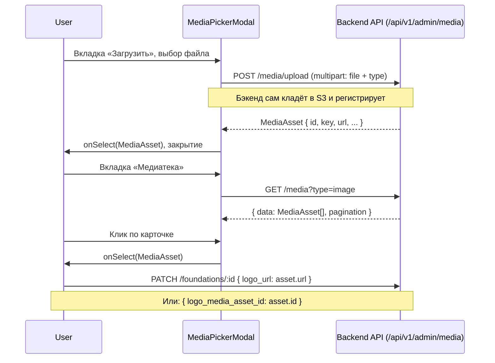

# Медиатека и загрузка файлов на фронте админки — руководство для «По Рублю»

Документ описывает, как реализована загрузка файлов на бэкенде и как фронтенд-разработчику построить медиатеку и выбор файла в формах на основе реального API.

---

## 1. Идея в двух словах

1. **Файл загружается отдельно** от PATCH/POST сущности. Сначала файл отправляется через `POST /api/v1/admin/media/upload` (multipart/form-data), бэкенд сам кладёт его в S3 и возвращает объект **`MediaAsset`** с `id` и `url`.
2. В формах сущностей (кампании, фонды, документы) в бэкенд уходит **строка URL** (поле `video_url`, `thumbnail_url`, `logo_url`, `file_url`) или **UUID** (`video_media_asset_id`, `thumbnail_media_asset_id`, `logo_media_asset_id`).
3. **Нет presigned URL, нет отдельного шага регистрации** — всё происходит в одном запросе `POST /media/upload`.

---

## 2. Контракт с бэкендом

Базовый префикс API: `/api/v1/admin/media`.

### 2.1. Загрузка файла

**POST** `/api/v1/admin/media/upload`

**Content-Type:** `multipart/form-data`

**Поля формы:**

| Поле | Тип | Обязательное | Описание |
|------|-----|:---:|----------|
| `file` | file (binary) | да | Файл для загрузки |
| `type` | string | да | Тип медиа: `video`, `document`, `audio` или `image` |

**Ограничения по типам:**

| Тип | Макс. размер | Допустимые MIME |
|-----|:---:|------|
| `video` | 500 МБ | `video/mp4` |
| `document` | 10 МБ | `application/pdf` |
| `audio` | 50 МБ | `audio/mpeg`, `audio/mp4`, `audio/ogg`, `audio/webm` |
| `image` | 20 МБ | `image/jpeg`, `image/png`, `image/webp`, `image/gif`, `image/svg+xml` |

**Ответ (200):**

```json
{
  "id": "0195a1b2-c3d4-7e5f-8a90-abcdef123456",
  "key": "images/a1b2c3d4e5f6789012345678abcdef.png",
  "url": "https://backend.porublyu.parmenid.tech/media/images/a1b2c3d4e5f6789012345678abcdef.png",
  "filename": "logo.png",
  "size_bytes": 245760,
  "content_type": "image/png"
}
```

**Пример загрузки с фронта:**

```ts
async function uploadMedia(file: File, type: "video" | "document" | "audio" | "image") {
  const formData = new FormData();
  formData.append("file", file);
  formData.append("type", type);

  const response = await api.post("/api/v1/admin/media/upload", formData);
  // НЕ задавайте Content-Type вручную — браузер сам добавит boundary
  return response.data; // { id, key, url, filename, size_bytes, content_type }
}
```

**Ошибки:**

| HTTP | Код | Описание |
|:---:|------|----------|
| 422 | `INVALID_MEDIA_TYPE` | Тип должен быть `video`, `document`, `audio` или `image` |
| 422 | `FILE_TOO_LARGE` | Файл превышает лимит |
| 422 | `INVALID_FILE_FORMAT` | Недопустимый MIME для выбранного типа |

### 2.2. Список файлов (медиатека)

**GET** `/api/v1/admin/media`

**Query-параметры:**

| Параметр | Тип | Описание |
|----------|-----|----------|
| `type` | string | Фильтр: `video`, `document`, `audio` или `image` |
| `search` | string | Поиск по имени файла или s3_key |
| `limit` | int | Количество (1–100, по умолчанию 20) |
| `cursor` | string | Курсор для следующей страницы |

**Ответ:**

```json
{
  "data": [
    {
      "id": "...",
      "key": "images/abc123.png",
      "url": "https://backend.porublyu.parmenid.tech/media/images/abc123.png",
      "type": "image",
      "filename": "logo.png",
      "size_bytes": 245760,
      "content_type": "image/png",
      "created_at": "2026-03-31T12:00:00Z"
    }
  ],
  "pagination": {
    "next_cursor": "eyJpZCI6ICIuLi4ifQ==",
    "has_more": true,
    "total": null
  }
}
```

### 2.3. Деталь файла

**GET** `/api/v1/admin/media/{id}`

Ответ: все поля из списка + `download_url` + `uploaded_by_admin_id`.

### 2.4. Скачивание

**GET** `/api/v1/admin/media/{id}/download`

Редирект 302 на публичный URL файла.

### 2.5. Использование в сущностях

При PATCH/POST кампании, фонда или документа передаётся **URL** или **UUID** медиа-ассета:

```json
// Вариант 1: передать URL напрямую
{ "logo_url": "https://backend.porublyu.parmenid.tech/media/images/abc123.png" }

// Вариант 2: передать UUID ассета (бэкенд сам подставит url)
{ "logo_media_asset_id": "0195a1b2-c3d4-7e5f-8a90-abcdef123456" }
```

Вариант с `*_media_asset_id` имеет **приоритет** — если указаны оба, бэкенд возьмёт URL из ассета.

---

## 3. Модель данных на фронте

Рекомендуемый тип `MediaAsset` (на основе реального ответа API):

```ts
interface MediaAsset {
  id: string;          // UUID
  key: string;         // S3-ключ: "images/abc123.png"
  url: string;         // Публичный URL для отображения и сохранения
  type: "video" | "document" | "audio" | "image";
  filename: string;    // Оригинальное имя файла
  size_bytes: number;
  content_type: string; // MIME: "image/png", "video/mp4", ...
  created_at: string;  // ISO 8601
}

// Деталь (расширение списочного элемента)
interface MediaAssetDetail extends MediaAsset {
  download_url: string;
  uploaded_by_admin_id: string | null;
}
```

**Канонический URL для сохранения в формах — это поле `url`** из ответа API. Не нужно собирать URL из частей.

---

## 4. Рекомендуемая архитектура фронтенда

| Слой | Путь | Роль |
|------|------|------|
| Типы | `entities/media/types.ts` | `MediaAsset`, `MediaAssetDetail` |
| API | `features/media/api/mediaApi.ts` | `uploadMedia`, `getMediaList`, `getMediaDetail` |
| Ключи React Query | `features/media/api/mediaKeys.ts` | `list`, `detail` |
| Хуки | `features/media/model/useMedia.ts` | `useMediaList`, `useUploadMedia`, `useDeleteMedia` |
| UI медиатеки | `features/media/ui/` | `MediaPickerModal`, `UploadDropzone`, `MediaCard` |
| Страница | `app/(dashboard)/media/page.tsx` | Сетка файлов, фильтр по типу, модалка загрузки |

---

## 5. Паттерн «выбор файла в форме»

1. В форме хранится **строка** (`logo_url`, `thumbnail_url`, `video_url`, `file_url`).
2. Рядом кнопка **«Выбрать»** открывает **`MediaPickerModal`**.
3. В **`onSelect(asset: MediaAsset)`** вызывается `setValue("logo_url", asset.url)`.
4. Сабмит формы шлёт PATCH/POST с этим полем — **без File в теле запроса**.

**Альтернатива:** передавать `logo_media_asset_id: asset.id` вместо URL — бэкенд сам разрезолвит.

### Примеры полей в формах:

| Сущность | Поля URL | Поля media_asset_id |
|----------|----------|---------------------|
| Фонд | `logo_url` | `logo_media_asset_id` |
| Кампания | `video_url`, `thumbnail_url` | `video_media_asset_id`, `thumbnail_media_asset_id` |
| Документ | — (через отдельный эндпоинт файла) | — |

### Документы — особый случай

У документов файл загружается не через общую медиатеку, а через специальные эндпоинты:

- **`POST /api/v1/admin/documents/{id}/file`** — multipart загрузка файла (PDF, DOCX, XLSX, PPTX, TXT, CSV, до 50 МБ)
- **`DELETE /api/v1/admin/documents/{id}/file`** — удаление файла

Бэкенд сам проставляет `file_url` в документе. В форме документа не нужна `MediaPickerModal` — используйте простой file input.

---

## 6. Компонент `MediaPickerModal`

Рекомендуемое поведение:

- Вкладка **«Медиатека»**: запрос `GET /media?type=image` (или без фильтра), сетка карточек, курсорная пагинация, empty state.
- Вкладка **«Загрузить»**: dropzone, вызов `uploadMedia(file, type)` → по успеху **`onSelect(uploadedAsset)`** и закрытие модалки.
- Проп **`mediaType`**: если задан, фильтрует список на бэкенде (`?type=image`) и ограничивает `accept` в dropzone.

**Пропсы:**

```ts
interface MediaPickerModalProps {
  isOpen: boolean;
  onClose: () => void;
  onSelect: (asset: MediaAsset) => void;
  mediaType?: "video" | "document" | "audio" | "image"; // фильтр
  title?: string;
}
```

### Вложенные модалки

Задайте **`z-index`** выше родительской модалки и **`closeOnOverlayClick={false}`**, чтобы случайный клик не закрыл всё.

---

## 7. Страница «Медиатека» и массовая загрузка

- Кнопка «Загрузить» открывает модалку с dropzone.
- Dropzone принимает несколько файлов, последовательно вызывает `uploadMedia` для каждого, показывает прогресс.
- Фильтр по типу (Select: все / видео / аудио / изображения / документы).
- Поиск по имени файла.
- Переключение сетка/список.
- Удаление — пока **нет** DELETE эндпоинта для медиа на бэкенде. Можно реализовать позже.

---

## 8. Карточка файла `MediaCard`

- Превью для изображений через `` (или `next/image`); для не-изображений — иконка по `content_type`.
- Отображение: имя файла, размер (форматированный), дата загрузки.
- Кнопка **копирования URL** в буфер.
- Режим **`selectable`**: клик по карточке вызывает `onSelect(asset)`.

**Определение типа для превью:**

```ts
function isImage(asset: MediaAsset): boolean {
  return asset.type === "image" || asset.content_type.startsWith("image/");
}
```

---

## 9. Определение `type` при загрузке

Фронт должен автоматически определять `type` на основе MIME файла:

```ts
function getMediaType(file: File): "video" | "document" | "audio" | "image" {
  if (file.type.startsWith("image/")) return "image";
  if (file.type.startsWith("video/")) return "video";
  if (file.type.startsWith("audio/")) return "audio";
  return "document";
}
```

Или задавать явно в контексте (например, при загрузке лого фонда — всегда `image`).

---

## 10. UX-рекомендации

- **Две вкладки** в модалке снижают когнитивную нагрузку: «взять из библиотеки» vs «залить новое».
- **Сразу выбрать файл после загрузки** — один непрерывный сценарий.
- **`closeOnOverlayClick={false}`** для вложенных модалок + явная кнопка «Отмена» в футере.
- **Поле URL + кнопка «Выбрать»** — возможность вставить внешнюю ссылку без медиатеки.
- **Превью и сброс** — пользователь видит результат до сохранения формы.
- **Валидация на фронте**: проверяйте MIME и размер файла до отправки — быстрый фидбек пользователю.
- **Не ставьте `Content-Type` вручную** при отправке `FormData` — браузер сам поставит `multipart/form-data; boundary=...`.

---

## 11. Чеклист для разработчика

1. **Тип `MediaAsset`** — создать на основе реального ответа API (раздел 3).
2. **API-клиент**: `uploadMedia(file, type)` через `FormData`, `getMediaList(params)`, `getMediaDetail(id)`.
3. **React Query**: список с фильтрацией/курсорной пагинацией, мутация загрузки с инвалидацией `mediaKeys.lists()`.
4. **`MediaPickerModal`**: библиотека + загрузка, проп `mediaType` для фильтрации.
5. **`MediaCard`**: превью для картинок, иконка для остального, копирование URL.
6. **Формы сущностей**: сохранять `asset.url` в state, отправлять в PATCH как строку или `*_media_asset_id` как UUID.
7. **Форма документа**: отдельный file input для `POST /documents/{id}/file`, без медиатеки.
8. **Валидация на фронте**: MIME + размер до отправки (см. таблицу ограничений в разделе 2.1).
9. **Страница медиатеки**: массовая загрузка, фильтр по типу, поиск.

---

## 12. Краткая схема потока данных



---

Документ подготовлен на основе реального API бэкенда «По Рублю» (`backend/app/api/v1/admin/media.py`, `backend/app/schemas/media.py`).
