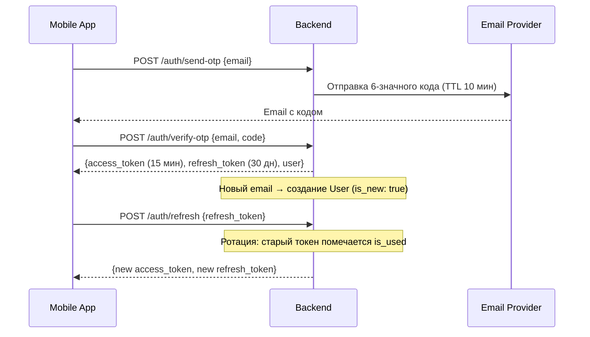
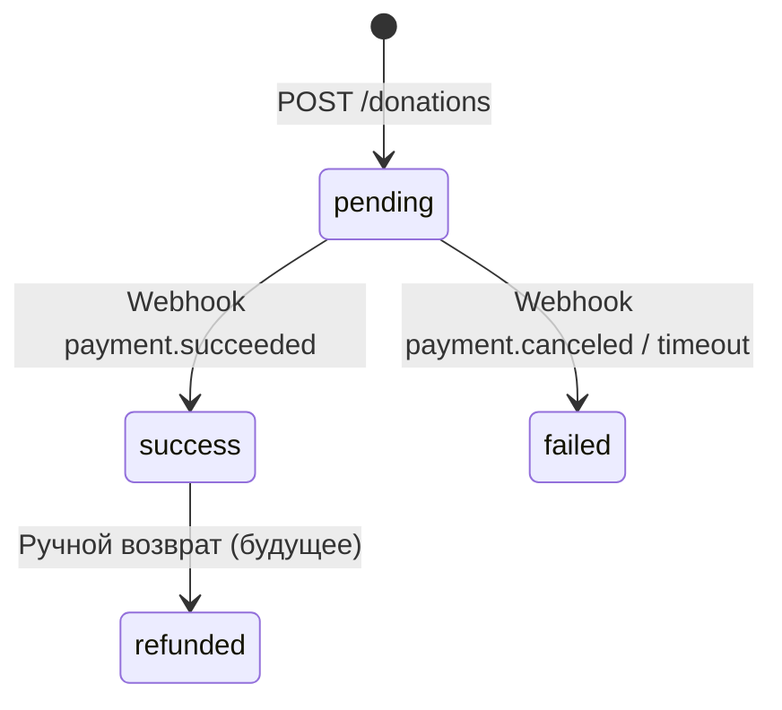
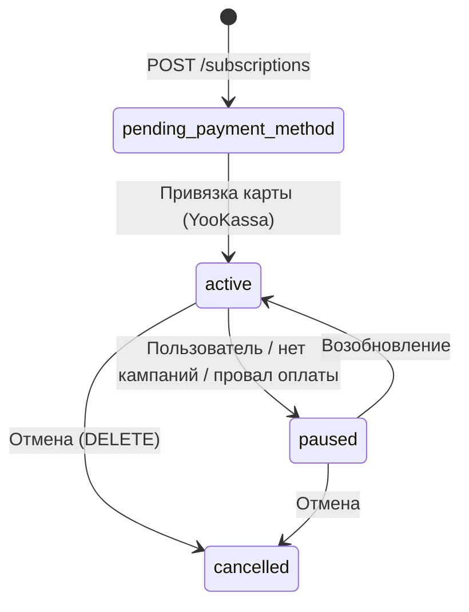
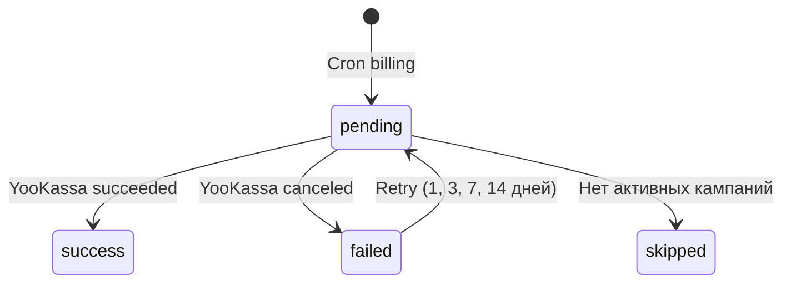
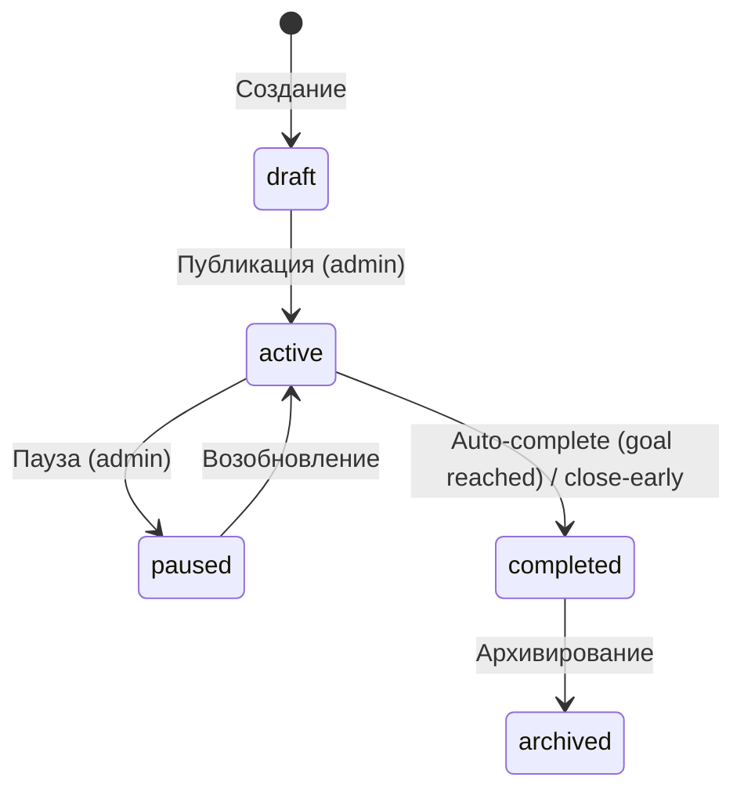

# «По Рублю» — Полная техническая спецификация и демо-план

> Версия: 1.0 | Дата: 2026-04-04
> Платформа микропожертвований для благотворительных фондов

---

## Оглавление

### БЛОК A — Техническое задание

1. [Обзор проекта](#1-обзор-проекта)
2. [Стек и архитектура](#2-стек-и-архитектура)
3. [Домены и сущности БД](#3-домены-и-сущности-бд)
4. [Группы API](#4-группы-api)
5. [Бизнес-логика](#5-бизнес-логика)
6. [Уведомления и Push](#6-уведомления-и-push)
7. [Интеграции](#7-интеграции)
8. [Фоновые задачи](#8-фоновые-задачи)
9. [Нефункциональные требования](#9-нефункциональные-требования)
10. [Что можно реализовать дальше (Backlog)](#10-backlog)
11. [Критерии приёмки](#11-критерии-приёмки)

### БЛОК B — Демо-контент

12. [Фонды](#12-фонды)
13. [Кампании](#13-кампании)
14. [Пользователи](#14-пользователи)
15. [Пожертвования и транзакции](#15-пожертвования-и-транзакции)
16. [Порядок действий в Admin API](#16-порядок-действий-в-admin-api)
17. [Процедура загрузки на сервер](#17-процедура-загрузки-на-сервер)
18. [SQL Seed скрипт](#18-sql-seed-скрипт)
19. [Чеклист перед презентацией](#19-чеклист-перед-презентацией)

---

# БЛОК A — ТЕХНИЧЕСКОЕ ЗАДАНИЕ

---

## 1. Обзор проекта

**«По Рублю»** — мобильная платформа микропожертвований. Пользователи жертвуют от 1 рубля в день на благотворительные кампании. Ключевые ценности: прозрачность, благодарность донору, конкретная польза.

**Целевая аудитория:**
- **Доноры** — обычные пользователи, жертвующие через приложение
- **Меценаты (Patron)** — пользователи, создающие платёжные ссылки для крупных пожертвований
- **Администраторы** — управляют фондами, кампаниями, контентом

**Ключевые возможности:**
- Разовые пожертвования (от 10 ₽)
- Подписки (1/3/5/10 ₽ в день, еженедельно или ежемесячно)
- Стратегии распределения средств (конкретная кампания / фонд / платформа)
- Лента кампаний с видео
- Благодарности (видео/аудио от подопечных)
- Достижения и стрик-система
- Документы кампаний (отчётность)
- Ссылки мецената
- Офлайн-платежи (запись администратором)
- Выплаты фондам с аудит-логом

---

## 2. Стек и архитектура

### Backend
| Компонент | Технология |
|---|---|
| Язык | Python 3.11+ |
| Web-фреймворк | FastAPI (async) |
| ORM | SQLAlchemy 2.0 (async, asyncpg) |
| БД | PostgreSQL 16 |
| Кеш / Брокер | Redis 7 |
| Миграции | Alembic |
| Фоновые задачи | TaskIQ + Redis broker |
| Объектное хранилище | MinIO (S3-совместимый) |
| Платежи | YooKassa API v3 |
| Push-уведомления | Firebase Admin SDK (FCM) |
| Email | SMTP / SendGrid (mock в dev) |
| Контейнеризация | Docker + Docker Compose |
| Reverse proxy | Nginx + Let's Encrypt (Certbot) |
| WSGI | Gunicorn + Uvicorn workers |

### Архитектурные слои

```
┌──────────────────────────────────────────┐
│            API Layer (FastAPI)            │
│   public/  │  admin/  │  webhooks  │ auth│
├──────────────────────────────────────────┤
│           Services Layer (16)            │
│  auth │ donation │ subscription │ ...    │
├──────────────────────────────────────────┤
│          Domain Layer (pure logic)       │
│ constants │ payment │ subscription │ ... │
├──────────────────────────────────────────┤
│        Repositories Layer (12)           │
│ user_repo │ campaign_repo │ stats_repo   │
├──────────────────────────────────────────┤
│          Models Layer (ORM, 20+)         │
│ User │ Campaign │ Donation │ ...         │
├──────────────────────────────────────────┤
│       Infrastructure                     │
│ database │ redis │ email │ S3 │ YooKassa │
└──────────────────────────────────────────┘
```

---

## 3. Домены и сущности БД

### 3.1. Перечень таблиц (20+)

| Таблица | Назначение | Миксины |
|---|---|---|
| `users` | Доноры и меценаты | UUID, Timestamp, SoftDelete |
| `otp_codes` | Одноразовые коды входа | UUID, Timestamp |
| `refresh_tokens` | JWT refresh-токены | UUID, Timestamp |
| `admins` | Администраторы | UUID, Timestamp |
| `foundations` | Благотворительные фонды | UUID, Timestamp |
| `campaigns` | Сборы / кампании | UUID, Timestamp |
| `campaign_documents` | Документы кампании (PDF) | UUID |
| `thanks_contents` | Благодарности (видео/аудио) | UUID |
| `thanks_content_shown` | Просмотр благодарностей | UUID |
| `donations` | Разовые пожертвования | UUID, Timestamp, SoftDelete |
| `subscriptions` | Подписки | UUID, Timestamp, SoftDelete |
| `transactions` | Платежи по подпискам | UUID, Timestamp |
| `campaign_donors` | Уникальные доноры (junction) | — |
| `allocation_changes` | Лог реаллокаций подписок | UUID |
| `achievements` | Достижения | UUID |
| `user_achievements` | Полученные достижения | UUID |
| `offline_payments` | Офлайн-платежи | UUID |
| `payout_records` | Выплаты фондам | UUID |
| `patron_payment_links` | Ссылки мецената | UUID |
| `media_assets` | Медиа-библиотека (S3) | UUID |
| `notification_logs` | Лог push-уведомлений | UUID |
| `documents` | CMS-документы (юр. инфо) | UUID, Timestamp, SoftDelete |

### 3.2. Enum-типы PostgreSQL (18)

| Enum | Значения |
|---|---|
| `FoundationStatus` | pending_verification, active, suspended |
| `CampaignStatus` | draft, active, paused, completed, archived |
| `UserRole` | donor, patron |
| `PushPlatform` | fcm, apns |
| `ThanksContentType` | video, audio |
| `DonationStatus` | pending, success, failed, refunded |
| `DonationSource` | app, patron_link, offline |
| `OfflinePaymentMethod` | cash, bank_transfer, other |
| `BillingPeriod` | weekly, monthly |
| `AllocationStrategy` | platform_pool, foundation_pool, specific_campaign |
| `SubscriptionStatus` | active, paused, cancelled, pending_payment_method |
| `PausedReason` | user_request, no_campaigns, payment_failed |
| `TransactionStatus` | pending, success, failed, skipped, refunded |
| `SkipReason` | no_active_campaigns |
| `AllocationChangeReason` | campaign_completed, campaign_closed_early, no_campaigns_in_foundation, no_campaigns_on_platform, manual_by_admin |
| `AchievementConditionType` | streak_days, total_amount_kopecks, donations_count |
| `PatronLinkStatus` | pending, paid, expired |
| `NotificationStatus` | sent, mock, failed |
| `DocumentStatus` | draft, published, archived |
| `MediaAssetType` | video, document, audio, image |

### 3.3. Денормализация (кеширующие поля)

| Таблица.Поле | Что хранит | Как обновляется |
|---|---|---|
| `campaigns.collected_amount` | Сумма всех успешных платежей | Атомарный `UPDATE +amount` при каждом платеже |
| `campaigns.donors_count` | Кол-во уникальных доноров | Через `campaign_donors` (INSERT ON CONFLICT) |
| `users.total_donated_kopecks` | Общая сумма пожертвований | Атомарный `UPDATE +amount` |
| `users.total_donations_count` | Кол-во пожертвований | Атомарный `UPDATE +1` |
| `users.current_streak_days` | Текущий стрик | Логика: вчера → +1, иначе → 1 |

Ежедневная **сверка (reconciliation)** в 5:00 UTC проверяет расхождения между кешем и реальными суммами.

---

## 4. Группы API

### 4.1. Public API — `/api/v1/...`

| Группа | Prefix | Эндпоинты | Авторизация |
|---|---|---|---|
| Health | `/health` | `GET /health` | Нет |
| Auth | `/auth` | `POST /send-otp`, `POST /verify-otp`, `POST /refresh`, `POST /logout` | Нет |
| Кампании | `/campaigns` | `GET /`, `GET /{id}`, `GET /{id}/documents` | Нет (публичное) |
| Фонды | `/foundations` | `GET /` | Нет |
| Профиль | `/me` | `GET`, `PUT`, `POST /notifications`, `DELETE` | Bearer (user) |
| Пожертвования | `/donations` | `POST /`, `GET /`, `GET /{id}` | Bearer (user) |
| Подписки | `/subscriptions` | `POST /`, `GET /`, `GET /{id}`, `PUT /{id}`, `POST /{id}/pause`, `POST /{id}/resume`, `DELETE /{id}` | Bearer (user) |
| Транзакции | `/transactions` | `GET /`, `GET /{id}` | Bearer (user) |
| Импакт | `/impact` | `GET /` | Bearer (user) |
| Благодарности | `/thanks` | `GET /`, `GET /{id}`, `POST /{id}/mark-shown` | Bearer (user) |
| Меценат | `/patron/payment-links` | `POST /`, `GET /`, `GET /{id}` | Bearer (patron) |
| Документы | `/documents` | `GET /`, `GET /{slug}` | Нет |
| Вебхуки | `/webhooks/yookassa` | `POST /` | IP-валидация YooKassa |
| Медиа-прокси | `/media/{s3_key}` | `GET` | Нет |

### 4.2. Admin API — `/api/v1/admin/...`

| Группа | Prefix | Основные эндпоинты | Авторизация |
|---|---|---|---|
| Auth | `/auth` | `POST /login`, `POST /refresh` | Нет (login) |
| Фонды | `/foundations` | CRUD: `GET`, `POST`, `GET /{id}`, `PUT /{id}` | Bearer (admin) |
| Кампании | `/campaigns` | CRUD + `POST /{id}/close-early`, `POST /{id}/force-realloc`, документы, благодарности | Bearer (admin) |
| Медиа | `/media` | `POST /`, `GET /`, `GET /{id}` | Bearer (admin) |
| Пользователи | `/users` | `GET`, `GET /{id}`, `POST /{id}/role`, `POST /{id}/active`, `DELETE /{id}` | Bearer (admin) |
| Статистика | `/stats` | `GET /overview`, `GET /campaigns/{id}` | Bearer (admin) |
| Выплаты | `/payouts` | `POST /`, `GET /`, `GET /balance` | Bearer (admin) |
| Достижения | `/achievements` | CRUD | Bearer (admin) |
| Логи | `/logs` | `GET /allocation-changes`, `GET /notifications` | Bearer (admin) |
| Администраторы | `/admins` | CRUD | Bearer (admin) |
| Документы | `/documents` | CRUD + `DELETE /{id}` | Bearer (admin) |

### 4.3. Пагинация

Все списки — **cursor-based** (не offset). Параметры: `limit` (1–100, default 20), `cursor` (opaque base64).

Ответ:
```json
{
  "data": [...],
  "pagination": {
    "next_cursor": "eyJpZCI6...}",
    "has_more": true,
    "total": null
  }
}
```

---

## 5. Бизнес-логика

### 5.1. Аутентификация (OTP + JWT RS256)



**Защита от replay-атак:** при повторном использовании refresh_token — отзыв ВСЕХ токенов пользователя.

**Лимиты:** max 5 попыток ввода OTP, rate limit 1 код в 60 секунд.

### 5.2. Разовые пожертвования (Donations)



**Поток:**
1. Пользователь выбирает кампанию и сумму (min 10 ₽ = 1000 копеек)
2. Сервер рассчитывает комиссии (15% платформа)
3. Создаётся платёж в YooKassa → `payment_url` для редиректа
4. Webhook `payment.succeeded`:
   - Атомарное обновление `collected_amount` кампании
   - Добавление в `campaign_donors` (ON CONFLICT DO NOTHING)
   - Обновление стрика пользователя
   - Обновление импакта пользователя
   - Проверка auto-complete кампании (если `collected >= goal`)
   - Проверка достижений
   - Push-уведомление об успехе
   - Проверка непросмотренных благодарностей → push

### 5.3. Подписки и аллокация



**Суммы подписок:** 100, 300, 500, 1000 копеек/день

**Billing period:** `weekly` (×7) или `monthly` (×30)

Пример: 100 коп/день × 30 дней = 3000 коп = 30 ₽/мес

**Стратегии распределения:**

| Стратегия | Логика |
|---|---|
| `specific_campaign` | Оплата идёт в указанную кампанию. Если закрыта → fallback на `foundation_pool` |
| `foundation_pool` | Самая приоритетная активная кампания фонда (по urgency DESC, sort_order ASC) |
| `platform_pool` | Самая приоритетная кампания на всей платформе (urgency + % сбора) |

**Реаллокация:** при закрытии кампании все привязанные подписки автоматически перераспределяются. Если кампаний нет → подписка ставится на паузу (`paused_reason: no_campaigns`).

**Лимит:** max 5 активных подписок на пользователя.

### 5.4. Транзакции подписок

Каждое списание подписки создаёт `Transaction`. Биллинг выполняется фоновой задачей каждые 30 минут.



### 5.5. Кампании и статусы



**Auto-complete:** если `collected_amount >= goal_amount` и `is_permanent = false` → автоматическая смена статуса на `completed`.

**Close-early:** администратор может закрыть кампанию досрочно с пометкой `close_note`.

**Документы кампании:** PDF-файлы (отчёты, справки), привязаны к кампании, доступны публично.

**Благодарности (Thanks):** видео/аудио от подопечных. Привязаны к кампании. Показываются донорам после оплаты (unseen → push → просмотр → mark-shown).

### 5.6. Достижения

| Тип условия | Пример |
|---|---|
| `streak_days` | «Стрик 7 дней» (условие: streak ≥ 7) |
| `total_amount_kopecks` | «Пожертвовал 10 000 ₽» (условие: total ≥ 1 000 000 коп) |
| `donations_count` | «10 пожертвований» (условие: count ≥ 10) |

Проверка после каждого успешного платежа. Новые достижения → push.

### 5.7. Ссылки мецената (Patron Links)

Меценат (role=patron) создаёт одноразовую платёжную ссылку:
- Указывает кампанию и сумму
- Ссылка действует 24 часа
- После оплаты → `status: paid`
- Donation создаётся с `source: patron_link`

### 5.8. Офлайн-платежи

Администратор регистрирует платёж вручную (наличные, банковский перевод):
- Привязан к кампании
- Увеличивает `collected_amount`
- Не создаёт Donation в обычном смысле
- Дедупликация по `(campaign_id, payment_date, amount, external_reference)`

### 5.9. Выплаты фондам

Администратор фиксирует выплату:
- `period_from / period_to` — период, за который выплата
- `transfer_reference` — номер платёжки
- `GET /balance` — расчёт: сумма nco_amount всех успешных платежей минус уже выплаченное

### 5.10. Формула комиссий

```
platform_fee = amount × 15% (округление вниз)
nco_amount = amount − platform_fee − acquiring_fee
```

Acquiring fee на текущий момент = 0 (может быть настроен).

---

## 6. Уведомления и Push

### 6.1. Провайдер

Настраивается через `NOTIFICATION_PROVIDER`:
- `mock` — логирует в structlog + запись в `notification_logs` со статусом `mock`
- `firebase` — отправка через Firebase Admin SDK (FCM)

### 6.2. Реально вызываемые уведомления в коде

| Событие | Тип (`notification_type`) | Где вызывается | Платформы |
|---|---|---|---|
| Успешный платёж (donation) | `donation_success` | `webhook.py → handle_payment_succeeded` | FCM (Android + iOS) |
| Успешный платёж (subscription txn) | `transaction_success` | `webhook.py → handle_payment_succeeded` | FCM |
| Новая благодарность доступна | `thanks_unseen` | `webhook.py → handle_payment_succeeded` | FCM |
| Новое достижение | `achievement_earned` | `webhook.py → handle_payment_succeeded` | FCM |
| Стрик-напоминание | `daily_streak` | `tasks/streak_push.py` (cron 12:00) | FCM |
| Реаллокация подписки | Не реализовано (лог есть, push нет) | — | — |

### 6.3. Пользовательские настройки

Поле `notification_preferences` (JSONB) в `users`:
```json
{
  "push_on_payment": true,
  "push_on_campaign_change": true,
  "push_daily_streak": true,
  "push_campaign_completed": true
}
```

Уведомление отправляется только если:
1. У пользователя есть `push_token`
2. Соответствующий флаг включён

### 6.4. FCM конфигурация

- **Android:** priority=high, click_action=`FLUTTER_NOTIFICATION_CLICK`, sound=default
- **iOS (APNs):** badge=1, sound=default
- **Data payload:** передаётся в `data` (строковые ключ-значения)

### 6.5. Обработка ошибок

- `UnregisteredError`, `SenderIdMismatchError`, `InvalidArgumentError` → автоматическая очистка `push_token`
- Все остальные ошибки → логируются, статус `failed`

### 6.6. Что НЕ реализовано

- ❌ Push при реаллокации подписки (лог allocation_changes существует, но push не отправляется)
- ❌ Push при закрытии кампании подписчикам
- ❌ Email-уведомления (кроме OTP)
- ❌ Push при достижении цели кампании (кроме авто-завершения)
- ❌ In-app уведомления (только push)
- ❌ Rich push (картинки в уведомлениях)
- ❌ APNs прямое подключение (только через FCM)
- ❌ Scheduled/delayed push
- ❌ Push-аналитика (delivery rate, open rate)

---

## 7. Интеграции

### 7.1. YooKassa (Платежи)

| Параметр | Значение |
|---|---|
| API версия | v3 |
| Метод аутентификации | Basic Auth (shop_id : secret_key) |
| Создание платежа | `POST /payments` |
| Получение платежа | `GET /payments/{id}` |
| Webhook endpoint | `POST /api/v1/webhooks/yookassa` |
| IP-валидация | Да (сети 185.71.76.0/27 и др.) |
| Сохранение метода оплаты | Да (для подписок) |
| Автоплатежи | Да (recurring через `payment_method_id`) |
| Валюта | RUB |

### 7.2. S3 / MinIO (Медиа)

| Параметр | Значение |
|---|---|
| Совместимость | Amazon S3 API |
| Бакет | `porubly` (public read) |
| Типы файлов | video/mp4, application/pdf, audio/mpeg+mp4+ogg+webm, image/jpeg+png+webp+gif+svg |
| Лимиты | видео 500 МБ, документы 10 МБ, аудио 50 МБ, изображения 20 МБ |
| Прокси | `/media/{s3_key}` — fallback при недоступности прямого доступа |
| Загрузка | Admin API `POST /admin/media/` (multipart/form-data) |

### 7.3. Firebase (Push)

| Параметр | Значение |
|---|---|
| SDK | firebase-admin 6.x |
| Протокол | FCM HTTP v1 |
| Credentials | Service Account JSON |
| Инициализация | Lazy (при первом push) |

### 7.4. Email (OTP)

| Провайдер | Поддержка |
|---|---|
| Mock | dev-режим, логирование OTP в stdout |
| SMTP | Произвольный SMTP-сервер |
| SendGrid | API v3 |

---

## 8. Фоновые задачи

Оркестратор: **TaskIQ** + Redis broker + LabelScheduleSource

| Задача | Расписание | Назначение |
|---|---|---|
| `process_recurring_billing` | `*/30 * * * *` (каждые 30 мин) | Списание подписок |
| `retry_failed_transactions` | `0 */6 * * *` (каждые 6 часов) | Повтор неудачных платежей (1, 3, 7, 14 дней) |
| `reconcile_collected_amount` | `0 5 * * *` (5:00 ежедневно) | Сверка сумм кампаний |
| `reconcile_donors_count` | `5 5 * * *` (5:05 ежедневно) | Сверка кол-ва доноров |
| `reconcile_user_impact` | `10 5 * * *` (5:10 ежедневно) | Сверка пользовательского импакта |
| `close_expired_campaigns` | `0 * * * *` (каждый час) | Закрытие кампаний с истёкшим сроком |
| `expire_patron_links` | `*/15 * * * *` (каждые 15 мин) | Экспирация ссылок мецената |
| `send_daily_streak_pushes` | `0 12 * * *` (12:00 ежедневно) | Стрик-напоминания |
| `cleanup_old_otp_codes` | `0 2 * * 0` (2:00 воскресенье) | Удаление старых OTP |

---

## 9. Нефункциональные требования

### 9.1. Безопасность

| Мера | Реализация |
|---|---|
| Аутентификация | JWT RS256 (2048-bit RSA) |
| Хеширование паролей | argon2 |
| Хеширование OTP | argon2 |
| Хеширование refresh tokens | SHA-256 |
| Replay attack protection | Ротация refresh_token + отзыв всех при reuse |
| Webhook IP validation | Whitelist YooKassa IP |
| Soft delete | Пользователи, донаты, подписки, документы |
| GDPR | `DELETE /me` — анонимизация пользователя |
| Rate limiting | slowapi (OTP: 5 per 60s) |
| CORS | Настраиваемый whitelist |
| Optimistic locking | Documents (version field) |

### 9.2. Логирование

- **Библиотека:** structlog
- **Формат:** JSON (структурированные логи)
- **Уровни:** info (основные операции), warning (расхождения reconciliation, ошибки push), error (YooKassa API errors)

### 9.3. Пагинация

- Cursor-based (UUID v7, автоматическая сортировка по времени)
- Лимит 1–100 записей на страницу

### 9.4. Идемпотентность

- Donations: `idempotence_key` (UUID, unique)
- Transactions: `idempotence_key` (UUID, unique)
- YooKassa: Idempotence-Key header

### 9.5. Деплой

- VPS: Ubuntu, Docker Compose
- SSL: Let's Encrypt (auto-renew)
- Reverse proxy: Nginx
- Healthcheck: `GET /api/v1/health`

### 9.6. Тесты

- Настроены зависимости: pytest, pytest-asyncio
- **Фактическое состояние:** тесты не написаны (каталог tests/ отсутствует)

---

## 10. Backlog

### Must (необходимо для production)

1. **Тесты** — unit, integration, e2e (тесты отсутствуют полностью)
2. **Email-отправка OTP** — сейчас mock; нужна интеграция с SMTP/SendGrid на проде
3. **Firebase credentials** — настроить на сервере (credentials JSON)
4. **Валидация webhook payload** — проверка подписи YooKassa (сейчас только IP)
5. **Rate limiting** — расширить на все публичные эндпоинты (сейчас только OTP)
6. **Миграции данных** — скрипт создания admin-пользователя при первом деплое

### Should (желательно)

7. **Push при реаллокации подписки** — уведомить донора о смене кампании
8. **Push при закрытии кампании** — уведомить подписчиков
9. **Email-уведомления** — квитанции об оплате, итоги месяца
10. **Поиск кампаний** — полнотекстовый поиск (сейчас нет search для public)
11. **Фильтрация ленты** — по фонду, по тегам (гипотеза: могут понадобиться теги)
12. **Автоматическая коррекция** при reconciliation (сейчас только логирование)
13. **Dashboard аналитики** — расширить stats: retention cohorts, воронки
14. **Webhooks исходящие** — уведомления фондам о новых пожертвованиях (гипотеза)

### Could (опционально)

15. **Telegram-бот** — уведомления через Telegram (гипотеза)
16. **Rich push** — изображения в уведомлениях
17. **Геймификация** — расширенная система ачивок, бейджи, уровни
18. **Реферальная программа** — пригласи друга (гипотеза)
19. **Виджет для сайтов** — встраиваемая форма пожертвования
20. **Мультивалютность** — поддержка не только рублей (гипотеза)
21. **API versioning** — v2 с breaking changes
22. **CDN** — вынос медиа на CDN (CloudFlare/Selectel)
23. **Кеширование** — Redis cache для ленты кампаний
24. **APNs direct** — прямое подключение к Apple Push (без FCM прокси)

---

## 11. Критерии приёмки

### 11.1. Чеклист интеграций

- [ ] OTP отправляется на email (mock или реальный SMTP)
- [ ] JWT access + refresh работают, ротация корректна
- [ ] Создание платежа в YooKassa → получение payment_url
- [ ] Webhook YooKassa → обновление статуса donation/transaction
- [ ] Автоплатёж подписки (recurring) через сохранённый метод
- [ ] Загрузка медиа в MinIO/S3 через admin API
- [ ] Медиа доступно по `/media/{s3_key}`
- [ ] Push-уведомление доставляется (FCM)
- [ ] Стрик-push отправляется в 12:00

### 11.2. Чеклист сценариев

- [ ] Гость видит ленту кампаний и документы
- [ ] Регистрация нового пользователя через OTP
- [ ] Разовое пожертвование → оплата → webhook → обновление прогресса
- [ ] Создание подписки → привязка карты → первый платёж
- [ ] Биллинг подписки (cron) → автоплатёж
- [ ] Пауза / возобновление подписки
- [ ] Закрытие кампании → реаллокация подписок
- [ ] Достижения: стрик 7 дней → ачивка
- [ ] Благодарности: unseen → push → просмотр → mark-shown
- [ ] Офлайн-платёж → обновление collected_amount
- [ ] Выплата фонду → запись + баланс
- [ ] Ссылка мецената → оплата → donation
- [ ] Reconciliation → лог расхождений
- [ ] Удаление аккаунта (GDPR)

---

# БЛОК B — ДЕМО-КОНТЕНТ

---

## 12. Фонды

### Фонд 1: «Доброе Сердце»
| Поле | Значение |
|---|---|
| name | Доброе Сердце |
| legal_name | БФ «Доброе Сердце» |
| inn | 7700000001 |
| description | Помогаем детям-сиротам и детям из малообеспеченных семей. Организуем праздники, покупаем игрушки и одежду, проводим развивающие занятия. |
| logo_url | *(загрузить через admin/media)* |
| website_url | https://dobroe-serdce.demo |
| status | active |

### Фонд 2: «Тёплый Дом»
| Поле | Значение |
|---|---|
| name | Тёплый Дом |
| legal_name | АНО «Тёплый Дом» |
| inn | 7700000002 |
| description | Строим и ремонтируем жильё для семей, пострадавших от стихийных бедствий. Каждый рубль — это кирпич в новом доме. |
| logo_url | *(загрузить через admin/media)* |
| website_url | https://teply-dom.demo |
| status | active |

### Фонд 3: «Пища Жизни»
| Поле | Значение |
|---|---|
| name | Пища Жизни |
| legal_name | БФ «Пища Жизни» |
| inn | 7700000003 |
| description | Готовим и раздаём горячие обеды тем, кто оказался в трудной ситуации. Кормим с теплом и уважением. |
| logo_url | *(загрузить через admin/media)* |
| website_url | https://pischa-zhizni.demo |
| status | active |

### Фонд 4: «Крылья Надежды»
| Поле | Значение |
|---|---|
| name | Крылья Надежды |
| legal_name | БФ «Крылья Надежды» |
| inn | 7700000004 |
| description | Поддерживаем волонтёров и социальные проекты. Помогаем людям помогать. |
| logo_url | *(загрузить через admin/media)* |
| website_url | https://krylya-nadezhdy.demo |
| status | active |

### Фонд 5: «Экощит»
| Поле | Значение |
|---|---|
| name | Экощит |
| legal_name | АНО «Экощит» |
| inn | 7700000005 |
| description | Защищаем дикую природу и побережья. Спасаем птиц, чистим пляжи, восстанавливаем экосистемы. |
| logo_url | *(загрузить через admin/media)* |
| website_url | https://ekoshchit.demo |
| status | active |

---

## 13. Кампании

Для каждого видео из `docs/mocks/feed/` — отдельная кампания. Тон: тёплый, уважительный, без давления.

---

### Кампания 1: «Радость для малышей»
- **Видео:** `Дети играют в детском доме.mp4`
- **Фонд:** Доброе Сердце
- **Описание:** Обустроим игровую комнату в детском доме «Солнышко». Новые развивающие игры, мягкие коврики и яркие краски — всё, чтобы ребята чувствовали себя как дома. Каждый рубль превращается в улыбку.
- **goal_amount:** 150 000 коп (1 500 ₽)
- **collected_amount:** ~95 000 коп (~63% — хороший прогресс)
- **urgency_level:** 4
- **is_permanent:** false
- **Документы:** «Смета на обустройство игровой» (PDF)
- **Благодарности:** `videoThanks0.mp4` (видео-благодарность от воспитателя), `Спасибо от ребенка.mp3` (аудио)

### Кампания 2: «Игрушки — в добрые руки»
- **Видео:** `Игрушки в детские дома.mp4`
- **Фонд:** Доброе Сердце
- **Описание:** Привезём коробки с новыми игрушками в три детских дома области. Мягкие мишки, конструкторы, настольные игры — то, что делает детство ярче.
- **goal_amount:** 80 000 коп (800 ₽)
- **collected_amount:** ~72 000 коп (~90% — почти собрано!)
- **urgency_level:** 3
- **is_permanent:** false
- **Документы:** «Список детских домов и потребностей» (PDF)
- **Благодарности:** `videoThanks2.mov` (видео)

### Кампания 3: «Первые шаги»
- **Видео:** `Пеленают младенца.mp4`
- **Фонд:** Доброе Сердце
- **Описание:** Помогаем молодым мамам из кризисных центров. Подгузники, пелёнки, детское питание — самое необходимое для малышей в первые месяцы жизни.
- **goal_amount:** 120 000 коп (1 200 ₽)
- **collected_amount:** ~35 000 коп (~29%)
- **urgency_level:** 5 (срочно)
- **is_permanent:** false
- **Документы:** «Список кризисных центров» (PDF)
- **Благодарности:** `Благодарность мамы.mp3` (аудио)

### Кампания 4: «Вместе с мамой»
- **Видео:** `Мама играет с ребенком.mp4`
- **Фонд:** Доброе Сердце
- **Описание:** Развивающие занятия для мам и малышей. Психолог, логопед, творческая мастерская — помогаем маленьким расти в заботе и внимании.
- **goal_amount:** 100 000 коп (1 000 ₽)
- **collected_amount:** ~48 000 коп (~48%)
- **urgency_level:** 3
- **is_permanent:** false
- **Документы:** «Программа занятий» (PDF)
- **Благодарности:** нет (no children-specific thanks needed here)

### Кампания 5: «Солнечная девочка»
- **Видео:** `Девочка играет.mp4`
- **Фонд:** Доброе Сердце
- **Описание:** Индивидуальная программа развития для Алисы. Занятия с логопедом, арт-терапия и адаптивная физкультура. Маленькие победы — большие шаги вперёд.
- **goal_amount:** 200 000 коп (2 000 ₽)
- **collected_amount:** ~112 000 коп (~56%)
- **urgency_level:** 4
- **is_permanent:** false
- **Документы:** «Программа реабилитации» (PDF)
- **Благодарности:** `Спасибо от ребенка.mp3` (аудио)

### Кампания 6: «Улыбка Маши»
- **Видео:** `Девочка смущается.mp4`
- **Фонд:** Доброе Сердце
- **Описание:** Маша мечтает о музыкальных занятиях. Собираем на синтезатор и 6 месяцев уроков с преподавателем. Музыка открывает мир.
- **goal_amount:** 90 000 коп (900 ₽)
- **collected_amount:** ~15 000 коп (~17% — начало пути)
- **urgency_level:** 2
- **is_permanent:** false
- **Документы:** «Рекомендация педагога» (PDF)

### Кампания 7: «Дом после стихии»
- **Видео:** `Стоительство домов для нуждающихся и пострадавших после наводнений.mp4`
- **Фонд:** Тёплый Дом
- **Описание:** Восстанавливаем жильё семьям, пострадавшим от наводнения. Стройматериалы, работа бригад, сушка и дезинфекция помещений. Новый дом — новое начало.
- **goal_amount:** 500 000 коп (5 000 ₽)
- **collected_amount:** ~180 000 коп (~36%)
- **urgency_level:** 5 (срочно)
- **is_permanent:** false
- **Документы:** «Акт обследования территории» (PDF), «Смета восстановительных работ» (PDF)

### Кампания 8: «Горячий обед для каждого»
- **Видео:** `Готовка блюд бездомных.mp4`
- **Фонд:** Пища Жизни
- **Описание:** Готовим и раздаём 200 порций горячей еды каждую неделю. Суп, каша, хлеб и чай — простые вещи, которые согревают. Готовим с заботой, раздаём с уважением.
- **goal_amount:** 250 000 коп (2 500 ₽)
- **collected_amount:** ~210 000 коп (~84%)
- **urgency_level:** 4
- **is_permanent:** true
- **Документы:** «Отчёт за март 2026» (PDF)

### Кампания 9: «Ифтар для общины»
- **Видео:** `Готовка на ифтар на Редукторном.mp4`
- **Фонд:** Пища Жизни
- **Описание:** Организуем ифтары в месяц Рамадан. Вкусная домашняя еда для всех, кто приходит. Традиция гостеприимства и единения.
- **goal_amount:** 180 000 коп (1 800 ₽)
- **collected_amount:** ~180 000 коп (100% — выполнено!)
- **urgency_level:** 3
- **is_permanent:** false
- **status:** completed (auto-complete по достижении цели)
- **Документы:** «Меню и закупки» (PDF)

### Кампания 10: «Птицы под защитой»
- **Видео:** `Защита чаек на побережье.mp4`
- **Фонд:** Экощит
- **Описание:** Защищаем гнездовья чаек и крачек на побережье. Ограждения, информационные стенды, патрулирование — чтобы птицы вернулись в следующем году.
- **goal_amount:** 300 000 коп (3 000 ₽)
- **collected_amount:** ~67 000 коп (~22%)
- **urgency_level:** 3
- **is_permanent:** false
- **Документы:** «Экологическое обследование побережья» (PDF)

### Кампания 11: «Красный Крест на передовой»
- **Видео:** `Волонтер Красный крест.mp4`
- **Фонд:** Крылья Надежды
- **Описание:** Поддержка волонтёров Красного Креста. Аптечки, термоодеяла, вода и еда — всё, что нужно для работы в полевых условиях.
- **goal_amount:** 350 000 коп (3 500 ₽)
- **collected_amount:** ~140 000 коп (~40%)
- **urgency_level:** 5 (срочно)
- **is_permanent:** false
- **Документы:** «Список необходимого оснащения» (PDF)

### Кампания 12: «Волонтёрский дух»
- **Видео:** `Волонтер за работой.mp4`
- **Фонд:** Крылья Надежды
- **Описание:** Экипировка и поддержка волонтёров на местах. Форма, инструменты, транспорт — чтобы помощь приходила вовремя.
- **goal_amount:** 100 000 коп (1 000 ₽)
- **collected_amount:** ~55 000 коп (~55%)
- **urgency_level:** 3
- **is_permanent:** false
- **Документы:** «План волонтёрских выездов» (PDF)

### Кампания 13: «Площадка для всех»
- **Видео:** `Несколько людей собрались вмест и танцуют - может какая-то площадка будет.mp4`
- **Фонд:** Крылья Надежды
- **Описание:** Строим открытую площадку для жителей района. Танцы, зарядка, мастер-классы — место, где соседи становятся друзьями.
- **goal_amount:** 400 000 коп (4 000 ₽)
- **collected_amount:** ~88 000 коп (~22%)
- **urgency_level:** 2
- **is_permanent:** false
- **Документы:** «Проект площадки» (PDF)

### Кампания 14: «Мечта Рустама»
- **Видео:** `Парень с тату на шее - может ему на идеи какие-то надо сбор.mp4`
- **Фонд:** Крылья Надежды
- **Описание:** Рустам — начинающий предприниматель из небольшого города. Собираем на оборудование для мастерской по ремонту электроники. Честный труд, реальный план, конкретный результат.
- **goal_amount:** 220 000 коп (2 200 ₽)
- **collected_amount:** ~44 000 коп (~20%)
- **urgency_level:** 2
- **is_permanent:** false
- **Документы:** «Бизнес-план мастерской» (PDF)

### Кампания 15: «Вместе — сила»
- **Видео:** `Группа людей смотрит сверху вниз на камеру.mp4`
- **Фонд:** Крылья Надежды
- **Описание:** Общий фонд поддержки волонтёрских инициатив. Ваш рубль помогает запускать новые проекты по всей стране. Прозрачная отчётность каждый месяц.
- **goal_amount:** null (бессрочный)
- **collected_amount:** ~320 000 коп
- **urgency_level:** 3
- **is_permanent:** true
- **Документы:** «Ежемесячный отчёт — март 2026» (PDF)

---

## 14. Пользователи

| # | name | email | role | Примечание |
|---|---|---|---|---|
| 1 | Малик | magamantium@gmail.com | donor | Без просмотренных thanks! |
| 2 | Анна Сергеева | anna.s@demo.test | donor | Активный донор |
| 3 | Дмитрий Козлов | dmitry.k@demo.test | donor | Средняя активность |
| 4 | Елена Морозова | elena.m@demo.test | donor | Новичок |
| 5 | Артём Волков | artem.v@demo.test | patron | Меценат |
| 6 | Марина Белова | marina.b@demo.test | donor | Подписка |
| 7 | Игорь Новиков | igor.n@demo.test | donor | Стрик 3 дня |
| 8 | Юлия Кузнецова | yulia.k@demo.test | patron | Меценат |
| 9 | Сергей Петров | sergey.p@demo.test | donor | Несколько подписок |
| 10 | Ольга Смирнова | olga.s@demo.test | donor | Один большой донат |

---

## 15. Пожертвования и транзакции

Все суммы в **копейках**. Диапазон 1 000 – 5 000 коп (10 – 50 ₽).

### Распределение пожертвований по кампаниям

| Пользователь | Кампания | Сумма (коп) | Статус |
|---|---|---|---|
| Малик | Радость для малышей | 2000 | success |
| Малик | Первые шаги | 1500 | success |
| Малик | Дом после стихии | 3000 | success |
| Анна | Радость для малышей | 5000 | success |
| Анна | Игрушки — в добрые руки | 4000 | success |
| Анна | Горячий обед для каждого | 3000 | success |
| Анна | Птицы под защитой | 2000 | success |
| Дмитрий | Солнечная девочка | 3000 | success |
| Дмитрий | Дом после стихии | 2500 | success |
| Дмитрий | Красный Крест на передовой | 4000 | success |
| Елена | Первые шаги | 1000 | success |
| Елена | Улыбка Маши | 1500 | success |
| Артём (patron) | Вместе — сила | 5000 | success |
| Артём (patron) | Площадка для всех | 5000 | success |
| Артём (patron) | Мечта Рустама | 4000 | success |
| Марина | Горячий обед для каждого | 2000 | success |
| Марина | Ифтар для общины | 3000 | success |
| Марина | Волонтёрский дух | 1500 | success |
| Игорь | Радость для малышей | 3000 | success |
| Игорь | Птицы под защитой | 2000 | success |
| Игорь | Красный Крест на передовой | 1000 | success |
| Юлия (patron) | Игрушки — в добрые руки | 5000 | success |
| Юлия (patron) | Вместе с мамой | 3000 | success |
| Сергей | Дом после стихии | 4000 | success |
| Сергей | Волонтёрский дух | 2000 | success |
| Сергей | Вместе — сила | 1500 | success |
| Ольга | Солнечная девочка | 5000 | success |
| Ольга | Площадка для всех | 3000 | success |

### Итоговый прогресс кампаний (после seed)

Прогресс будет записан напрямую в `collected_amount` в SQL seed (включая «историю» — как будто было много мелких пожертвований от других пользователей тоже).

---

## 16. Порядок действий в Admin API

### Шаг 1: Авторизация

```bash
POST /api/v1/admin/auth/login
Body: {"email": "admin@porublyu.ru", "password": "<пароль>"}
→ Сохранить access_token
```

### Шаг 2: Загрузка медиа

```bash
POST /api/v1/admin/media/
Content-Type: multipart/form-data
Body: file=@"Дети играют в детском доме.mp4"
→ Получить {id, key, url}
```

Повторить для каждого видео из `docs/mocks/feed/` и `docs/mocks/thanks/`.

**Обязательные поля:** `file` (multipart)
**Ограничения:** video/mp4 ≤ 500 МБ, audio/mpeg ≤ 50 МБ, application/pdf ≤ 10 МБ, image/* ≤ 20 МБ

### Шаг 3: Создание фондов

```bash
POST /api/v1/admin/foundations/
Body: {
  "name": "Доброе Сердце",
  "legal_name": "БФ «Доброе Сердце»",
  "inn": "7700000001",
  "description": "Помогаем детям-сиротам..."
}
```

Затем активировать:
```bash
PUT /api/v1/admin/foundations/{id}
Body: {"status": "active"}
```

### Шаг 4: Создание кампаний

```bash
POST /api/v1/admin/campaigns/
Body: {
  "foundation_id": "<foundation_uuid>",
  "title": "Радость для малышей",
  "description": "Обустроим игровую комнату...",
  "video_url": "<url из шага 2>",
  "thumbnail_url": "<url если есть>",
  "goal_amount": 150000,
  "urgency_level": 4,
  "is_permanent": false
}
```

Затем перевести в active:
```bash
PUT /api/v1/admin/campaigns/{id}
Body: {"status": "active"}
```

### Шаг 5: Добавление документов к кампании

```bash
POST /api/v1/admin/campaigns/{id}/documents
Body: {
  "title": "Смета на обустройство игровой",
  "file_url": "<url из media>"
}
```

### Шаг 6: Добавление благодарностей

```bash
POST /api/v1/admin/campaigns/{id}/thanks
Body: {
  "type": "video",
  "media_url": "<url из media>",
  "title": "Спасибо от воспитателя",
  "description": "Воспитатель детского дома благодарит всех, кто помог"
}
```

### Типичные ошибки

| Ошибка | Причина | Решение |
|---|---|---|
| 404 Foundation not found | foundation_id не существует | Сначала создать фонд |
| 422 CAMPAIGN_INVALID_STATUS | Попытка active → draft | Допустимые переходы: draft→active, active→paused, paused→active, active→completed |
| 413 File too large | Видео > 500 МБ | Сжать файл |
| 422 Invalid content type | Не video/mp4 | Конвертировать в mp4 |

---

## 17. Процедура загрузки на сервер

### 17.1. Бэкап текущей БД

```bash
# На сервере:
docker compose -f docker-compose.prod.yml exec postgres \
  pg_dump -U ${POSTGRES_USER} -d ${POSTGRES_DB} \
  --format=custom -f /tmp/backup_$(date +%Y%m%d_%H%M%S).dump

# Скопировать бэкап наружу:
docker compose -f docker-compose.prod.yml cp \
  postgres:/tmp/backup_*.dump ./backups/
```

### 17.2. Загрузка медиа через Admin API

**Скрипт для массовой загрузки (выполнять локально):**

```bash
#!/bin/bash
API="https://backend.porublyu.parmenid.tech/api/v1/admin"

# 1. Получить токен
TOKEN=$(curl -s -X POST "$API/auth/login" \
  -H "Content-Type: application/json" \
  -d '{"email":"admin@porublyu.ru","password":"'"$ADMIN_PASSWORD"'"}' \
  | python3 -c "import sys,json; print(json.load(sys.stdin)['access_token'])")

# 2. Загрузить видео
for f in docs/mocks/feed/*.mp4; do
  echo "Uploading: $f"
  curl -X POST "$API/media/" \
    -H "Authorization: Bearer $TOKEN" \
    -F "file=@$f" \
    | python3 -c "import sys,json; d=json.load(sys.stdin); print(f'ID: {d[\"id\"]}  URL: {d[\"url\"]}')"
  echo ""
done

# 3. Загрузить благодарности
for f in docs/mocks/thanks/*; do
  echo "Uploading thanks: $f"
  curl -X POST "$API/media/" \
    -H "Authorization: Bearer $TOKEN" \
    -F "file=@$f" \
    | python3 -c "import sys,json; d=json.load(sys.stdin); print(f'ID: {d[\"id\"]}  URL: {d[\"url\"]}')"
  echo ""
done
```

### 17.3. Накатить SQL seed

```bash
# Скопировать seed на сервер:
scp docs/demo_seed.sql user@${SERVER}:/tmp/

# На сервере:
docker compose -f docker-compose.prod.yml exec -T postgres \
  psql -U ${POSTGRES_USER} -d ${POSTGRES_DB} < /tmp/demo_seed.sql
```

---

## 18. SQL Seed скрипт

> **Примечание:** UUID и media_url будут подставлены после загрузки медиа. Ниже — шаблон с плейсхолдерами.

```sql
-- ============================================
-- ДЕМО SEED ДЛЯ «ПО РУБЛЮ»
-- Выполнять ПОСЛЕ загрузки медиа через Admin API
-- и ПОСЛЕ создания фондов/кампаний через Admin API
-- ============================================

BEGIN;

-- ============================================
-- 1. ПОЛЬЗОВАТЕЛИ
-- ============================================

-- Пароли не нужны (OTP-авторизация). Создаём записи напрямую.
-- UUID v7 генерируем через gen_random_uuid() (PostgreSQL 16+)

INSERT INTO users (id, email, name, role, is_active, current_streak_days, last_streak_date, total_donated_kopecks, total_donations_count, created_at, updated_at) VALUES
  (gen_random_uuid(), 'magamantium@gmail.com', 'Малик', 'donor', true, 0, NULL, 6500, 3, NOW() - INTERVAL '14 days', NOW()),
  (gen_random_uuid(), 'anna.s@demo.test', 'Анна Сергеева', 'donor', true, 5, CURRENT_DATE - 1, 14000, 4, NOW() - INTERVAL '30 days', NOW()),
  (gen_random_uuid(), 'dmitry.k@demo.test', 'Дмитрий Козлов', 'donor', true, 2, CURRENT_DATE - 1, 9500, 3, NOW() - INTERVAL '20 days', NOW()),
  (gen_random_uuid(), 'elena.m@demo.test', 'Елена Морозова', 'donor', true, 0, NULL, 2500, 2, NOW() - INTERVAL '5 days', NOW()),
  (gen_random_uuid(), 'artem.v@demo.test', 'Артём Волков', 'patron', true, 3, CURRENT_DATE - 1, 14000, 3, NOW() - INTERVAL '25 days', NOW()),
  (gen_random_uuid(), 'marina.b@demo.test', 'Марина Белова', 'donor', true, 7, CURRENT_DATE, 6500, 3, NOW() - INTERVAL '18 days', NOW()),
  (gen_random_uuid(), 'igor.n@demo.test', 'Игорь Новиков', 'donor', true, 3, CURRENT_DATE, 6000, 3, NOW() - INTERVAL '12 days', NOW()),
  (gen_random_uuid(), 'yulia.k@demo.test', 'Юлия Кузнецова', 'patron', true, 1, CURRENT_DATE - 2, 8000, 2, NOW() - INTERVAL '22 days', NOW()),
  (gen_random_uuid(), 'sergey.p@demo.test', 'Сергей Петров', 'donor', true, 0, NULL, 7500, 3, NOW() - INTERVAL '10 days', NOW()),
  (gen_random_uuid(), 'olga.s@demo.test', 'Ольга Смирнова', 'donor', true, 1, CURRENT_DATE - 3, 8000, 2, NOW() - INTERVAL '8 days', NOW());

COMMIT;
```

> **ВАЖНО:** Полный seed-скрипт с реальными UUID и media_url будет сгенерирован автоматически ПОСЛЕ загрузки медиа на сервер. Скрипт ниже в разделе 17 описывает полную процедуру.

---

## 19. Чеклист перед презентацией

### Приложение (мобильное)

- [ ] **Лента кампаний** — видно 14–15 активных кампаний с видео, thumbnail, прогресс-бар
- [ ] **Кампания «Ифтар для общины»** — статус completed, 100% прогресс
- [ ] **Деталь кампании** — описание, видео воспроизводится, документы загружаются
- [ ] **Документы кампании** — PDF открывается/скачивается
- [ ] **Благодарности (unseen)** — для пользователя magamantium@gmail.com видны непросмотренные thanks
- [ ] **Просмотр благодарности** — видео/аудио воспроизводится, mark-shown работает
- [ ] **Регистрация** — OTP приходит (mock или реальный email)
- [ ] **Профиль** — имя, email, роль отображаются
- [ ] **История пожертвований** — список с разными суммами и кампаниями
- [ ] **Импакт** — total_donated, streak_days, donations_count
- [ ] **Разные роли** — donor vs patron (у patron — раздел «Ссылки мецената»)
- [ ] **Фонды** — список активных фондов в публичном API
- [ ] **Прогресс кампаний** — разный % у разных кампаний (17%–100%)

### Админка

- [ ] **Логин** — вход по email/password
- [ ] **Список фондов** — 5 фондов, все active
- [ ] **Список кампаний** — 15 кампаний, фильтрация по статусу
- [ ] **Медиа-библиотека** — загруженные видео и аудио
- [ ] **Статистика** — GMV, active subscriptions, donors
- [ ] **Пользователи** — 10 пользователей с разными ролями

### Сервер

- [ ] **API доступен** — `GET /api/v1/health` → 200
- [ ] **Медиа доступно** — видео воспроизводится по URL
- [ ] **БД бэкап** — дамп создан и сохранён
